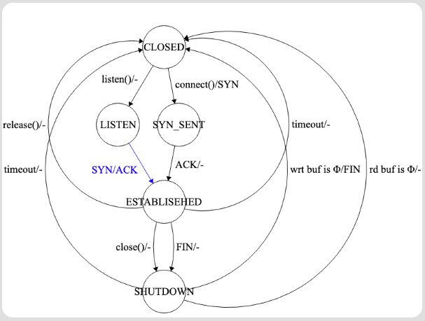

# uTCP on Fishnet
This project implements a one-directional TCP protocol with flow control and congestion control on Fishnet simulator/emulator

- Author: Richard Wu
- Date: 2021 Oct 24
- GitHub repo: https://github.com/wuyuanpei/TCPFishnet

+ The first section of the report discusses the implementation details
+ The second section describes the finite state machine of the protocol
+ The third section answers the discussion questions
+ The last section shows all the experiments and traces

## Implementing the protocol (Go-Back-N with AIMD/Cubic) and socket API

### Packet and Transport
- ``class Packet`` is used to simulate packets in network layer, thus it contains IP header like ``dest`` address, ``src`` address, ``ttl``, etc.
- The payload of ``Packet`` is a packeted object of ``class Transport`` which simulates transport layer, containing ``srcPort``, ``destPort``, ``seqNum``, etc.

### TCPManager
- ``class TCPManager`` is used to manage all the TCP sockets. It contains an array list (named ``sockets``) of sockets (``class TCPSock``).
- When a new packet is received, ``node.receivePacket()`` will forward the packet to ``tcpMan.onReceive()`` which will use ``findBestMatch()`` to multiplex the packet to one of the sockets in ``sockets`` and call ``bestSock.onReceive()``.
- ``findBestMatch()`` will first find a socket with exactly the same four-tuple, i.e.,``dest`` (``localAddr``), ``src`` (``remoteAddr``), ``destPort`` (``localPort``), ``srcPort`` (``remotePort``) as the incoming packet. If nothing is found, it will find a socket with the same local port and address but ``-1`` remote port and address, i.e., the socket is a welcome socket.
- If ``findBestMatch()`` returns ``null``, then ``tcpMan.onReceive`` will send a ``FIN`` packet and print out ``X``. (When ``findBestMatch()`` returns ``null`` and the incoming packet is ``FIN``, then nothing will be sent to avoid ``FIN`` looping issue)
- ``isUsed()`` will go through ``sockets`` and check whether the same four-tuple has already existed. It will be used by functions like ``bind()``.

### TCPSock
#### Basic Fields
- A ``TCPSock`` object has state ``CLOSED``, ``LISTEN``, ``SYN_SENT``, ``ESTABLISHED``, ``SHUTDOWN``.
- ``SHUTDOWN`` state is used when ``close`` is requested, but ``FIN`` has not been sent (due to unsent data in write buffer); or ``FIN`` is received, but read buffer is not empty
- A ``TCPSock`` object has fields ``localPort``, ``localAddr``, ``remotePort``, ``remoteAddr``
- A ``TCPSock`` object has fields ``estRTT``, ``devRTT``, ``alpha``, ``beta``, which are used to estimate RTT and calculate ``DATATimeout``. ``sampleRTTs`` is key-value pairs where key is the sequence number and value is the sent time.
- **A ``TCPSock`` object has field ``baseSeq`` which is always the first sequence number that has not been ACKed yet**
- **A ``TCPSock`` object has field ``sendSeq`` which is always the first sequence number that has just been sent (actually plus 1), meaning that ``tryToSend`` (which sends packet for the first time) should always use ``sendSeq`` as the seq number**
- **A ``TCPSock`` object has field ``seqNumbers`` which is a queue that stores all the sequence numbers that have been sent but not ACKed**
- A ``TCPSock`` object has a field ``connQ`` which is an array list of ``TCPSock``. It is a connection queue only used by the welcome socket. The connection queue can have maximum size ``backlog``. ``connQ`` is a local data structure in welcome socket, which should not be confused with the global data structure ``sockets`` in ``TPCManager``.
- A ``TCPSock`` object has a field ``readWindow`` which is a byte array. It is used at the receiver side to store data and buffer for ``read()``. ``readWindow`` has size ``BUFFER_SIZE * Transport.MAX_PAYLOAD_SIZE``, i.e., it can only hold ``BUFFER_SIZE`` TCP packets with full payload size. It has two pointers ``readPointer`` and ``writePointer`` for accessing the window.
- Both pointers need to mod ``readWindow.length`` when accessing window, and both pointers are strictly increasing: ``readPointer`` must always be less than or equal to ``writePointer`` but their difference cannot be greater than ``readWindow.length`` (otherwise, overflow). ``readPointer`` is used by ``read()`` to get data from it and ``writePointer`` is used by ``onReceive()`` to write data into it.
- A ``TCPSock`` object has a field ``writeWindow`` which is a byte array. It is used at the sender side to store data and buffer for ``write()``. ``writeWindow`` has size ``BUFFER_SIZE * Transport.MAX_PAYLOAD_SIZE``, i.e., it can only hold ``BUFFER_SIZE`` TCP packets with full payload size. It has three pointers ``readWPointer`` and ``writeWPointer`` and ``readSafeWPointer`` for accessing the window.
- ``readWPointer`` always points to the first byte that has not been sent (the first time)
- ``writeWPointer`` always points to the first byte that ``write()`` is going to write
- ``readSafeWPointer`` always points to the first byte that has not been ACKed yet
- The invariance is: ``writeWPointer >= readWPointer >= readSafeWPointer`` and ``(writeWPointer - readSafeWPointer) <= writeWindow.length``
- A ``TCPSock`` object has fields ``cwnd``, ``cwndCurrent``, ``ssthresh`` which are used for congestion control
- A ``TCPSock`` object has field ``windowAvail``, which is used for flow control: it always stores the remaining ``readWindow`` size from the ACK packet returned
- A ``TCPSock`` object also has fields for cubic congestion control

#### Basic functions
- When creating a new ``TCPSock`` object, for the state and addresses/ports:
```java
this.state = State.CLOSED;
this.localAddr = localAddr;
this.localPort = -1; // should be set by bind()
this.remoteAddr = -1;
this.remotePort = -1;
```
- ``bind()``: this function will check ``tcpMan.isUsed == false`` and set ``this.localPort`` and then put the socket into the global structure ``tcpMan.sockets``
- ``listen()``: this function will transfer the state from ``CLOSED`` to ``LISTEN`` and set up the ``connQ``.
- ``accept()``: this function will return the first socket in ``connQ`` and add it into ``tcpMan.sockets``. If ``state != State.LISTEN || connQ == null || connQ.size() == 0``, then ``null`` is returned. **It is important that before ``accept()`` is called, the newly created socket, though ``ESTABLISHED``, is not in ``sockets``, so the socket cannot be directly reached by ``TCPManager`` in ``findBestMatch()``**.
- ``connect()``: this function will set ``this.remotePort`` and ``this.remoteAddr``, and then send a ``SYN`` packet with ``startSeq`` equal to a random number between 1 to 1000, and print out ``S``. It will transfer the state from ``CLOSED`` to ``SYN_SENT``. A timeout (1 sec) will be set to resend the ``SYN`` packet if ``ACK`` is not received timely.
- ``release()``: this function simply set the state to ``CLOSED`` and remove the socket from ``tcpMan.sockets``.
- ``close()``: this function will shut down the socket gracefully. If the socket is a welcome socket, then call ``release()``. If ``readSafeWPointer == writeWPointer && seqNumbers.isEmpty()``, meaning that no packet need to be resent and ``writeWindow`` is empty (always true for server side), then send ``FIN`` print ``F`` and ``release()``. Otherwise, do nothing and set the state to ``SHUTDOWN``.
- ``write()``: this function will write data into ``writeWindow`` and then attempt to send packets (by calling ``tryToSend()``) 
- ``tryToSend()`` is the trickiest function: if the number of in-flight packets is less than ``cwnd`` and the ``windowAvail`` (the client still has remaining ``readWindow``) is greater than the bytes that have already sent, then it will send as many packets as possible in the ``writeWindow``. A timeout will be set to resend the packet if ``ACK`` is not received (a callback of ``resendData``). Timeout will follow the formula:
```
alpha = 0.125;
beta = 0.25;
EstRTT = (1 - alpha) * EstRTT + alpha * SampleRTT
DevRTT = (1 - beta) * DevRTT + beta * |SampleRTT - EstRTT|
```
- ``resendData()``: this is another trickiest function. It serves as the callback of ``tryToSend()`` and may also be directly called by ``onReceive()`` for receiving triple duplicated ACKs. It takes four argument: ``firstSendSeqI`` records the first seq number that was previously sent in the batch of packets. ``finalSendSeqI`` records the last seq number that was previously sent in the batch of packets. ``isTimeout`` marks whether it's the callback due to timeout, or it is due to triple dupliated ACKs. ``timeSet`` is used to mark when this function is "created" or "called" by ``tryToSend`` or ``onReceive``, respectively.
- ``resendData()`` will not do anything if neither ``firstSendSeqI`` and ``finalSendSeqI`` are not in ``seqNumbers`` or ``timeSet`` is less than ``lastFireResend`` (which is used to record the time that ``tryToSend`` is actually executed). The last timing condition is used to avoid resending: if a resending happens (for example, due to triple duplicated ACKs), then the previous resending callbacks created should be discarded (for example, timeout set by ``tryToSend``).
- ``resendData()`` will resend all the in-flight packets documented in ``seqNumbers``.
- ``read()``: this function will simply read from ``readWindow`` and update ``readPointer``.
- ``onReceive()``: this function is the most complicated one that handles incoming packet. See below. 

#### Receive different packets
- For receiving ``SYN``: the welcome socket will create a new socket and add it to ``connQ`` (if the same four-tuple does not exist). It will send back an ``ACK`` packet (ack with ``seq + 1``). ``FIN`` will be sent if the state is not correct or ``connQ.size >= backlog``. Note that an ``ESTABLISED`` packet can receive ``SYN`` if the first ``SYN`` times out and the second gets redirected to the connection socket rather than the welcome socket, because it has been accepted (i.e., put into ``sockets``).
- For receiving ``ACK``: if the current state is ``SYN_SENT`` and ``seq == baseSeq + 1``, i.e. this is the ``ACK`` for my ``SYN``, then the state will be set to ``ESTABLISHED``, and ``baseSeq += 1``. If the current state is ``ESTABLISHED`` and ``seq`` is in ``seqNumbers`` (i.e., this is one of the expected ACKs), then ``baseSeq`` will be set to ``seq`` and ``readSafeWPointer`` will be moved backward by payload length.(Note that ``seq`` may not be ``seqNumbers.get(0)``, as ACK packet may be lost). ``estRTT`` and ``devRTT`` are calculated and used to reset ``DATATimeout``. Cubic functions are used to calculate ``cwnd`` and ``windowAvail`` is updated. Then it will call ``tryToSend``. If the ACK is not expected (a wrong seq number), then it will call ``resendData`` if the seq number has been received three times before. If the current state is ``SHUTDOWN``, then besides all the operations for ``ESTABLISEHED``, ``close()`` will be called after receiving an expected ``ACK``.
- For receiving ``DATA``: if a welcome socket receives a ``DATA`` packet, it will forward it to the socket in ``connQ`` (the socket has not been ``accepted`` yet) if any, otherwise, ``FIN`` will be sent back. If the connection socket receives a ``DATA`` packet, it will first check whether ``seq == baseSeq`` (i.e., the packet is expected) and it has enough read window size. If so, ``baseSeq += payload.length`` and send ``ACK`` with ``seq == baseSeq``. Finally, it will save the payload in ``readWindow``. For out of order packet or the case where ``readWindow`` does not have enough space, ``ACK`` with the old ``seq`` will be sent back.
- For receiving ``FIN`` packet: if ``readWindow`` is empty, simply call ``release()`` and print out ``F``. If not, just set the state to ``SHUTDOWN``. If this is a connection socket and ``onReceive()`` has not been called for a long time, then ``release()`` will be called using the callback timer. Therefore, even if ``FIN`` is lost, a connection socket will eventually be closed. (Note that the server need to explicitly close its welcome socket).

### Flow Control
- The receiver will record its available ``readWindow`` size in the ACK packet
- Every time ``tryToSend`` is called, besides ``cwnd`` checking for in-flight packets, the available window size at the receiver side is also checked
- **Note that the sender always sends (at least) one packet even if the receiver returns 0 for available read window size.** This is important to avoid "chicken-and-egg" problem: if no packet is sent, then no ACK will return, then the sender does not know whether the receiver has consumed the packets yet, then no more packet will be sent.

### Congestion Control
- We implement two congestion control algorithms: AIMD and Cubic. (The slow start for AIMD is not implemented)
- AIMD is simple: when an expected ACK is received, ``cwnd += 1/cwnd``; when ``resendData`` is called, ``cwnd /= 2``. Please check the testing below for AIMD performance.
- Cubic is implemented too. Please check out ``cubic_reset()``, ``cubic_update()``, ``cubic_tcp_friendliness()``. The algorithm replaces ``cwnd += 1/cwnd`` in ``onReceive`` for ACK and ``cwnd /= 2`` in ``resendData``.

## Finite State Machine



The FSM of the protocol is shown in the figure above. Initially, the state of ``TCPSock`` is ``CLOSED``. When ``listen()`` is called, it will enter ``LISTEN`` state (i.e., become a welcome socket). On the other hand, if ``connect()`` is called, it will send ``SYN`` and enter ``SYN_SENT`` state (i.e., become a sender connection socket). If ``SYN`` is received at ``LISTEN`` state, then the welcome socket will respond with ``ACK`` and create a receiver connection socket with ``ESTABLISHED`` state. If ``ACK`` is received at the ``SYN_SENT`` state of the sender connection socket, the socket will turn into ``ESTABLISHED`` too.

In the ``ESTABLISHED`` state, the sender will transfer ``DATA`` and the receiver will receive ``DATA`` and respond with ``ACK``. If ``release()`` is called or timeout happens (for the case when ``FIN`` is not received), then the socket will go from ``ESTABLISHED`` to ``CLOSED`` directly. 

If the sender calls ``closed()``, then the sender connection socket will enter ``SHUTDOWN``. Then if write buffer is empty (i.e., no pending or in-flight data), it will send ``FIN`` and enter ``CLOSED``.

If the receiver receives ``FIN``, then the receiver connection socket will enter ``SHUTDOWN`` and then if the read buffer is empty, it will enter ``CLOSED``.

## Discussion Questions
### Part 2 discussions

- Diss1a: Your transport protocol implementation picks an initial sequence number when establishing a new connection. This might be 1, or it could be a random value. Which is better, and why?

A random value is better, because then a malicious attacker cannot fake an ACK packet with the sequence number that the sender expects. A random sequence number can let the sender make sure that the receiver receives the SYN packet is ready to accept data.

- Diss1b: Our connection setup protocol is vulnerable to the following attack. The attacker sends a large number of connection request (SYN) packets to a particular node, but never sends any data. (This is called a SYN flood.) What happens to your implementation if it were attacked in this way? How might you have designed the initial handshake protocol (or the protocol implementation) differently to be more robust to this attack?

In my implementation, a connection socket (not welcome socket) will time out if ``onReceive`` has not been called for a fixed amount of time (e.g., 60 seconds), and then it will release automatically. Also, the welcome socket can only take ``backlog`` number of connections before any of them has been ``accepted``, so the memory will not be overwhelmed. We can design the initial handshake protocol to defend this attack: in the ACK returned from SYN (indicated by the receiver) or in the SYN itself (indicated by the sender), we can have a new timeout field. If the sender does not send anything under the time constraint, both sides can assume that the socket can be closed.

- Diss1c: What happens in your implementation when a sender transfers data but never closes a connection? (This is called a FIN attack.) How might we design the protocol differently to better handle this case?

Again, in my implementation, a connection socket (not welcome socket) will time out if ``onReceive`` has not been called for a fixed amount of time (e.g., 60 seconds), and then it will release automatically. A timeout field in every DATA packet will work. The timeout field will indicate how long the next packet will come. If the timer expires, both side can assume that the socket can be closed, as if FIN is sent.

- Diss2: Your transport protocol implementation picks the size of a buffer for received data that is used as part of flow control. How large should this buffer be, and why?

This buffer will hold data for ``read()``. It will be written by DATA from ``onReceive`` and read by ``read()``. Ideally, if the application layer can read the buffer infinitely fast, then as long as the buffer can hold one packet, we should be fine. However, if we receive a batch of packets (e.g., ``cwnd`` number of packets) and the application reading speed is not fast enough compared to the receiving rate of packets in the same batch, then read buffer size must be at least ``cwnd`` times packet size to avoid discarding data. Currently, assume the receiver and send has the same speed (of calling ``write()`` and ``read()``), we set both read buffer and write buffer size to be the same constant times packet size. The ``cwnd`` in the testing environment can reach roughly 32, so we set the constant to be 32 too.

### Part 3 discussions
- 3.4 Delivery Flexibilities: Some major networks (e.g., Amazon Scalable Reliable Datagram) propose that the network does not enforce in-order delivery. Please describe how you may design a flexible API and protocol so that the transport can provide flexibilities such as delivery order (segments can be delivered to applications not in order) and reliability semantics/flexibilities (e.g., some packets do not need reliability, and one can use FEC to correct errors instead of using retransmissions).

For the flexibility on delivery order: the ``write()`` function will have a special argument for the application layer so that the application layer can mark the byte stream of a ``write`` as "delivery order flexible" (dof). The dof bytes will be put into a separate write buffer (named ``DOFwriteWindow``) rather than ``writeWindow``. The TCP header will have a separate bit to indicate dof or not dof (i.e., ``dof bit``). The bytes in ``DOFwriteWindow`` will be packed into TCP packets (with ``dof bit`` set) separate from the bytes in ``writeWindow`` (with ``dof bit`` not set). Also, whenever there is some ``write`` into ``DOFwriteWindow``, the current ``writeWPointer`` of ``writeWindow`` will be recorded, so that whenever it is possible to send packets (``cwndCurrent`` is less than ``cwnd``), all the bytes, no matter in ``writeWindow`` or ``DOFwriteWindow``, will be served in "first come first served" fashion. (If there is nothing in ``DOFwriteWindow``, send bytes in ``writeWindow``. Otherwise, if the ``readWPointer`` has not reached the recorded ``writeWPointer``, send from ``writeWindow``, otherwise, send from ``DOFWriteWindow``). The TCP packets with ``dof bit`` set uses **selective ACK** instead of cumulative ACK. The sender will send dof packets with a separate system of seq number (may start from a random number too). When a receiver receives a dof packet, it does not check seq number (though the packet has a seq number) and it puts the bytes into the ``readWindow`` directly. It then replies with ACK seq equal to the seq number of the incoming dof packet (i.e., SACK). The sender still has time out mechanism for retransmission to ensure reliability.

For the flexibility on reliablity: similarly, the ``write()`` function will have a special argument for the application layer so that the application layer can mark the byte stream of a ``write`` as "reliability flexible" (rf). It also has an argument for the application layer to specify the ECC scheme (for example, Hamming code) or even no ECC scheme (errors are just acceptable). Again, the rf bytes will be put into a separate write buffer (named ``RFwriteWindow``) rather than ``writeWindow``. The TCP header will have a separate bit to indicate rf or not rf (i.e., ``rf bit``) and a byte to indicate ECC scheme. Whenever there is some ``write`` into ``RFFwriteWindow``, the current ``writeWPointer`` of ``writeWindow`` will be recorded, so that whenever it is possible to send packets (``cwndCurrent`` is less than ``cwnd``), all the bytes, no matter in ``writeWindow`` or ``RFwriteWindow``, will be served in "first come first served" fashion. When the sender sends rf bytes, it will use the ECC specified to encode the information (for example, ``111`` to encode ``1`` and ``000`` to encode ``0``, rather than ``1`` or ``0`` itself) and mark the ``rf bit`` and ``ECC byte`` of the TCP packet. The receiver of the packet will ACK this packet without checking the validity of its content. The receiver will decode the original content based on ECC (for example, ``100``, ``010``, ``001`` all mean ``0``, in spite of the fact that one bit get flipped).

- 3.1 Multipath TCP API and protocol: Your current API is the basic socket API. In class, we discussed multi-path TCP. How may you extend your socket to allow multi-path API? Please (1) specify the issues of existing API to support multipath TCP, (2) list the new API, clearly marking modifications and/or additions to the API, (3) give an example of client and server programs using your multi-path TCP API, and (4) briefly describe how your implementation (protocol format, server, client) will be changed to support multipath TCP. For this design exercise, you can assume bi-directional transport.

The problem of the existing API is that the application layer cannot bind its socket to multiple addresses. For example, if the machine has both a WiFi interface and a cellular network interface, the application cannot bind its MPTCP socket to both IP addresses to create two paths. Also, in the current design, each socket does not know whether it is a regular TCP connection or it is a subconnection inside a MPTCP connection, thus it does not know which congestion control algorithm to use and how to handle the bytes sent/received. The solution is that we need to create some additional functions/objects listed below to support MPTCP. First, when a socket is created by ``TCPMananger``, the application need to specify whether it is a regular TCP or MPTCP. If MPTCP, then a special MPTCP socket will be returned. The MPTCP socket contains an array of regular TCP sockets. The MPTCP socket will have a function ``addTCPSock()`` to create a new TCP socket (that corresponds to one IP address and port number pair) inside it with the specific address and port number told by the application. Also it has a function ``removeTCPSock()`` that closes a TCP socket (may or may not be used by a subflow) inside the MPTCP socket. Applications can call ``addTCPSock()`` and ``removeTCPSock()`` even if a MPTCP connection has been established. If they are called, then a signal will be sent to the peer to advertise new possible subconnections or close current subconnections. Applications can ``read()`` and ``write()`` into a MPTCP socket just as a regular TCP socket. For ``write()``, MPTCP socket will store the data in its own ``writeWindow`` and the TCP sockets inside it will read from the shared ``writeWindow`` and send data onto the its specific network wire (note that lock is needed to avoid race). For ``read()``, the TCP socket (each subflow) will forward the data to the shared ``readWindow`` from which the application can read. The flow control and congestion control are managed by each TCP socket (i.e., each subflow) individually. At the very beginning when a sender (client) that supports MPTCP tries to connect to a receiver (server) that also supports MPTCP, the MPTCP sender will pick one of its available TCP socket and connect to one of the remote TCP socket spcified in ``connect()``. The sender then should advertise all of its available IP addresses and ports that are going to be used in a special type of packets called ``ADV`` (after ``SYN``, ``ACK`` but before ``DATA``). Then the receiver (server) can create a corresponding number of TCP sockets inside a MPTCP socket using its available pool of TCP sockets, each of which will send an ACK packet to one of the TCP sockets advertised by the client to establish connection. During the connection, when either side calls ``addTCPSock()`` or ``removeTCPSock()``, the change will be advertised to the peer through ``ADV``: new subconnections will be created if possible, dead subconnections will be closed. At the very end, when ``closed()`` is called by the application for the MPTCP socket, the MPTCP socket will call the ``closed()`` function in each TCP socket to clear up each subconnection. Usages in client side and server side look like the following:

For the client side:
```java
boolean isMPTCPSocket = true;
MPTCPSock mptcpSock = this.tcpMan.socket(isMPTCPSocket);
mptcpSock.addTCPSock(addr1, port1);
mptcpSock.addTCPSock(addr2, port2);
mptcpSock.addTCPSock(addr3, port3);
mptcpSock.connect(destAddr, port); // one of (addr4, port4), (addr5, port5), (addr6, port6)
mptcpSock.write(buf, index, len);
mptcpSock.close();
```

For the server side:
```java
boolean isMPTCPSocket = true;
MPTCPSock mptcpSock = this.tcpMan.socket(isMPTCPSocket);
mptcpSock.addTCPSock(addr4, port4);
mptcpSock.addTCPSock(addr5, port5);
mptcpSock.addTCPSock(addr6, port6);
mptcpSock.listen(backlog);
while(true) {
	MPTCPSock connSock = mptcpSock.accept();
	connSock.read(buf, index, len);
	connSock.close();
}
```

## Testing
- I first implement "stop-and-wait", i.e., the ``cwnd`` is fixed at 1.
- Then I implement "Go-Back-N" without fast retransmission (3 duplicated ACKs), flow control, and congestion control.
- Next, I implement AIMD and fast retransmission.
- Finally, I implement Cubic.

### Simulate
- For stop-and-wait:
```
(base) Richards-MacBook-Pro:TCPFishnet wuyuanpei$ perl fishnet.pl simulate 2 scripts/transfertest.fish

Node 0: started

Node 1: started

Node 0: server started, port = 21
SS::
Node 0: time = 1005 msec

Node 0: connection accepted

Node 1: time = 1010 msec

Node 1: started

Node 1: bytes to send = 50000
..::..::..::..::..::..::..::..::..::..::..::..::..::..::..::..::..::..::..::..::..::..::..::..::..::..::..::..::..::..::..::..::..::..::..::..::..::..::..::..::..::..::..::..::..::..::..::..::..::..::..::..::..::..::..::..::..::..::..::..::..::..::..::..::..::..::..::..::..::..::..::..::..::..::..::..::..::..::..::..::..::..::..::..::..::..::..::..::..::..::..::..::..::..::..::..::..::..::..::..::..::..::..::..::..::..::..::..::..::..::..::..::..::..::..::..::..::..::..::..::..::..::..::..::..::..::..::..::..::..::..::..::..::..::..::..::..::..::..::..::..::..::..::..::..::..::..::..::..::..::..::..::..::..::..::..::..::..::..::..::..::..::..::..::..::..::..::..::..::..::..::..::..::..::..::..::..::..::..::..::..::..::..::..::..::..::..::..::..::..::..::..::..::..::..::..::..::..::..::..::..::..::..::..::..::..::..::..::..::..::..::..::..::..::..::..::..::..::..::..::..::..::..::..::..::..::..::..::..::..::..::..::..::..::..::..::..::..::..::..::..::..::..::..::..::..::..::..::..::..::..::..::..::..::..::..::..::..::..::..::..::..::..::..::..::..::..::..::..::..::..::..::..::..::..::..::..::..::..::..::..::..::..::..::..::..::..::..::..::..::..::..::..::..::..::..::..::..::..::..::..::..::..::..::..::..::..::..::..::..::..::..::..::..::..::..::..::..::..::..::..::..::..::..::..::..::..::..::..::..::..::..::..::..::..::..::..::..::..::..::..::..::..::..::..::..::..::..::..::..::..::..::..::..::..::..::..::..::..::..::..::..::..::..::..::..::..::..::..::..::..::..::..::..::..::..::..::..::..::..::..::..::..::..::..::..::..::..::..::..::..::..::..::..::..::..::..::..::..::..::..::..::..::..::..::..::..::..::..::..::..::..::..::..::..::..::..::..::..::..::..::..::..::..::..::..::..::..::..::..::..::..::..::..::..::..::..::..::..::..::..::..::..::..::..::..::..::..::..::..::..::..::..::..::..::..::..::..::..::..::..::..::..::..::..::..::..::..::
Node 1: time = 469010

Node 1: sending completed

Node 1: closing connection...
FF
Node 0: time = 470005 msec

Node 0: connection closed

Node 0: total bytes received = 50000

Node 1: time = 470010 msec

Node 1: connection closed

Node 1: total bytes sent = 50000

Node 1: time elapsed = 469000 msec

Node 1: Bps = 106.60980810234541
Fishnet exiting after time: 1000020 msec.
Number of packets sent: 939
Number of packets dropped: 0
Number of packets lost: 0
```
It can be observed that ``total bytes received == total bytes sent == 50000`` without any problem. Note that because both the receiver and the sender print, every symbol is printed out twice, for example, ``..::`` essentially means ``.:``, i.e. one ``DATA`` packet sent and one ACK received.

At the beginning, we have ``SS::``, ``SYN`` sent and ``ACK`` received. Then we have repeated pattern of ``..::``, ``DATA`` sent and ``ACK`` received, and finally, we have ``FF``.

- For Cubic:
```
(base) Richards-MacBook-Pro:TCPFishnet wuyuanpei$ perl fishnet.pl simulate 2 scripts/transfertest.fish

Node 0: started

Node 1: started

Node 0: server started, port = 21
SS::
Node 0: time = 1005 msec

Node 0: connection accepted

Node 1: time = 1010 msec

Node 1: started

Node 1: bytes to send = 50000
..::...::...::...::...::...::...::...::..!!!!!!!!!.::..::...::..::...::..::...::..:!!!!!!!!!!!!:.::.!??!??!??!!!!!!!!!!!!??!??!??!??!??!??.::.::..::...::..::.::.::.::.::.::!??!!!!!!??!??!!!!!!??!??!??!??!??!??!??!??!??.::!??!??!??!!!!!??!??!??!??!??!??!??!??.::.::.::.::!??!??!??!??!??!??!??!??!??!??!??!??!??.!??.::............::...::..::...::..::...::..::...::..::...::..::...::..::...::.::.::.::.::.::.::.::.::.::.::.::.::.::.::.::.::.::..::............................::...::..::..::.::.::.::.::.::.::.::.::.::.::.::.::.::.::.::.::.::.::.::.::.::.::.::.::.::.::.::..::................................::.::.::.::.::.::.::.::.::.::.::.::.::.::.::.::.::.::.::.::.::.::.::.::.::.::.::.::.::.::.::..::................................::.::.::.::.::.::.::.::.::.::.::.::.::.::.::.::.::.::.::.::.::.::.::.::.::.::.::.::.::.::.::..::................................::.::.::.::.::.::.::.::.::.::.::.::.::.::.::.::.::.::.::.::.::.::.::.::.::.::.::.::.::.::.::..::................................::.::.::.::.::.::.::.::.::.::.::.::.::.::.::.::.::.::.::.::.::.::.::.::.::.::.::.::.::.::.::..::................................::.::.::.::.::.::.::.::.::.::.::.::.::.::.::.::.::.::.::.::.::.::.::.::.::.::.::.::.::.::.::..::................................::.::.::.::.::.::.::.::.::.::.::.::.::.::.::.::.::.::.::.::.::.::.::.::.::.::.::.::.::.::.::..::................................::.::.::.::.::.::.::.::.::.::.::.::.::.::.::.::.::.::.::.::.::.::.::.::.::.::.::.::.::.::.::..::................................::.::.::.::.::.::.::.::.::.::.::.::.::.::.::.::.::.::.::.::.::.::.::.::.::.::.::.::.::.::.::..::................................::.::.::.::.::.::.::.::.::.::.::.::.::.::.::.::.::.::.::.::.::.::.::.::.::.::.::.::.::.::.::..::................................::.::.::.::.::.::.::.::.::.::.::.::.::.::.::.::.::.::.::.::.::.::.::.::.::.::.::.::.::.::.::..::................................::.::.::.::.::.::.::.::.::.::.::.::.::.::.::.::.::.::.::.::.::.::.::.::.::.::.::.::.::.::.::..::....................::.::.::.::.::.::.::.::.::.::.::.::.::.::.::.::.::.::.::
Node 1: time = 16010

Node 1: sending completed

Node 1: closing connection...
FF
Node 0: time = 17005 msec

Node 0: connection closed

Node 0: total bytes received = 50000

Node 1: time = 17010 msec

Node 1: connection closed

Node 1: total bytes sent = 50000

Node 1: time elapsed = 16000 msec

Node 1: Bps = 3125.0
Fishnet exiting after time: 1000020 msec.
Number of packets sent: 1031
Number of packets dropped: 0
Number of packets lost: 0
```
There are some retransmission at the beginning. (We can see that the first retransmission happens after three pairs of ``??``, meaning that fast retransmission is working)

### Emulate
- For "stop-and-wait":

Trawler:
```
(base) Richards-MacBook-Pro:TCPFishnet wuyuanpei$ perl trawler.pl 8888 scripts/three.topo 
Trawler awaiting fish...
Got port 10000: assigning addr: 0
Got port 10001: assigning addr: 1
```

Node 0:
```
(base) Richards-MacBook-Pro:TCPFishnet wuyuanpei$ perl fishnet.pl emulate localhost 8888 10000

Node 0: started
server 6 3

Node 0: server started, port = 6
S:
Node 0: time = 1635114763360 msec

Node 0: connection accepted
.:.:.:.:.:.:.:.:.:.:.:.:.:.:.:.:.:.:.:.:.:.:.:.:.:.:.:.:!?.:!?.:!?.:.:!?.:.:.:.:.:.:.:.:.:.:.:.:.:.:!?.:!?.:.:.:.:.:.:.:.:.:.:.:.:.:.:.:.:.:.:.:.:.:.:.:.:.:.:.:.:.:.:.:.:.:.:.:.:.:.:.:.:.:.:.:.:.:.:.:F
Node 0: time = 1635114858711 msec

Node 0: connection closed

Node 0: total bytes received = 10000
```

Node 1:
```
(base) Richards-MacBook-Pro:TCPFishnet wuyuanpei$ perl fishnet.pl emulate localhost 8888 10001

Node 1: started
transfer 0 6 5 10000
S:
Node 1: time = 1635114764065 msec

Node 1: started

Node 1: bytes to send = 10000
.:.:.:.:.:.:.:.:.:.:.:.:.:.:.:.:.:.:.:.:.:.:.:.:.:.:.:.!:?.!:?.!:?.:.!:?.:.:.:.:.:.:.:.:.:.:.:.:.:.!:?.!:?.:.:.:.:.:.:.:.:.:.:.:.:.:.:.:.:.:.:.:.:.:.:.:.:.:.:.:.:.:.:.:.:.:.:.:.:.:.:.:.:.:.:.:.:.:.:.:
Node 1: time = 1635114858457

Node 1: sending completed

Node 1: closing connection...
F
Node 1: time = 1635114859458 msec

Node 1: connection closed

Node 1: total bytes sent = 10000

Node 1: time elapsed = 95393 msec

Node 1: Bps = 104.82949482666443
```

Note that in the emulation mode, we have ``S:`` at the beginning, ``F`` at the end, both ``.:`` and ``!?`` (meaning retransmission and ``ACK`` that does not advance) in the middle. The retransmission is due to premature retransmission caused by the inaccuracy of estimated RTT.

#### Go-Back-N trace 1
- without any congestion/flow control
- On default setting with 10KB/s bandwidth and 250 ms buffering capacity (i.e., basically no loss)
- fix windows size 16

Trawer:
```
(base) Richards-MacBook-Pro:TCPFishnet wuyuanpei$ perl trawler.pl 8888 scripts/three.topo 
Trawler awaiting fish...
Got port 10000: assigning addr: 0
Got port 10001: assigning addr: 1
```

Node 0:
```
(base) Richards-MacBook-Pro:TCPFishnet wuyuanpei$ perl fishnet.pl emate localhost 8888 10000

Node 0: started
server 6 3

Node 0: server started, port = 6
S:
Node 0: time = 1635202066655 msec

Node 0: connection accepted
.:.:.:.:.:.:.:.:.:.:.:.:.:.:.:.:.:.:.:.:.:.:.:.:.:!?!?!?!?!?!?!?!?!?!?!?!?!?!?!?!?!?!?.:!?.:.:.:.:.:.:!?!?!?!?!?!?!?!?!?!?!?!?!?!?!?!?!?.:.:.:.:.:.:.:.:.:.:.:.:.:.:.:.:.:.:.:.:.:.:.:.:.:.:.:.:.:.:.:.:.:.:.:.:.:.:.:.:.:.:.:.:.:.:.:.:.:.:.:.:.:.:.:.:.:.:.:.:.:.:.:.:.:.:.:.:.:.:.:.:.:.:.:.:.:.:.:.:.:.:.:.:.:.:.:.:.:.:.:.:.:.:.:.:.:.:.:.:.:.:.:.:.:.:.:.:.:.:.:.:.:.:.:.:.:.:.:.:.:.:.:.:.:.:.:.:.:.:.:.:.:.:.:.:.:.:.:.:.:.:.:.:.:.:.:.:.:.:.:.:.:.:.:.:.:.:.:.:.:.:.:.:.:.:.:.:.:.:.:.:.:.:.:.:.:.:.:.:.:.:.:.:.:.:.:.:.:.:.:.:.:.:.:.:.:.:.:.:.:.:.:.:.:.:.:.:.:.:.:.:.:.:.:.:.:.:.:.:.:.:.:.:.:.:.:.:.:.:.:.:.:.:.:.:.:.:.:.:.:.:.:.:.:.:.:.:.:.:.:.:.:.:.:.:.:.:.:.:.:.:.:.:.:.:.:.:.:.:.:.:.:.:.:.:.:.:.:.:.:.:.:.:.:.:.:.:.:.:.:.:.:.:.:.:.:.:.:.:.:.:.:.:.:.:.:.:.:.:.:.:.:.:.:.:.:.:.:.:.:.:.:.:.:.:.:.:.:.:.:.:.:.:.:.:.:.:.:.:.:.:F
Node 0: time = 1635202080685 msec

Node 0: connection closed

Node 0: total bytes received = 40000
```

Node 1:
```
(base) Richards-MacBook-Pro:TCPFishnet wuyuanpei$ perl fishnepl emulate localhost 8888 10001

Node 1: started
transfer 0 6 4 40000
S:
Node 1: time = 1635202067616 msec

Node 1: started

Node 1: bytes to send = 40000
................:.:.:.:.:.:.:.:.:.!!!!!!!!!!!!!!!!!!!!!!!!!!!!!!!!:.:.!!!!!!!!!!!!!!!!:.:.!!!!!!!!!!!!!!!!:.!!!!!!!!!!!!!!!!:.:.:!!!!!!!!!!!!!!!::::!!!!!!!!!!!::!!!!!!!!!::??????!!!!!!!??!!!!!!!????!!!!!!!???!!!!!!!??!!!!!!!?:?:!!!!!::!!!:::?????????????????................:.:.:.:.:.:.:.:.:.:.:.:.:.:.:.:.::::::::::::::::................:.:.:.:.:.:.:.:.:.:.:.:.:.:.:.:.::::::::::::::::................:.:.:.:.:.:.:.:.:.:.:.:.:.:.:.:.::::::::::::::::................:.:.:.:.:.:.:.:.:.:.:.:.:.:.:.:.::::::::::::::::................:.:.:.:.:.:.:.:.:.:.:.:.:.:.:.:.::::::::::::::::................:.:.:.:.:.:.:.:.:.:.:.:.:.:.:.:.::::::::::::::::................:.:.:.:.:.:.:.:.:.:.:.:.:.:.:.:.::::::::::::::::................:.:.:.:.:.:.:.:.:.:.:.:.:.:.:.:.::::::::::::::::................:.:.:.:.:.:.:.:.:.:.:.:.:.:.:.:.::::::::::::::::................:.:.:.:.:.:.:.:.:.:.:.:.:.:.:.:.::::::::::::::::................:.:.:.:.:.:.::::::::::::::::
Node 1: time = 1635202079677

Node 1: sending completed

Node 1: closing connection...
F
Node 1: time = 1635202080684 msec

Node 1: connection closed

Node 1: total bytes sent = 40000

Node 1: time elapsed = 13068 msec

Node 1: Bps = 3060.912151821243
```
We can see that now retransmission retransmits the packets in the entire window.

#### Go-Back-N trace 2
- without any congestion/flow control
- On default setting with 2KB/s bandwidth and 150 ms buffering capacity (i.e., with loss)
- fix windows size 16

Trawer:
```
(base) Richards-MacBook-Pro:TCPFishnet wuyuanpei$ cat scripts/three.topo 
edge 0 1 bw 2000 bt 150
edge 1 2
edge 0 2
(base) Richards-MacBook-Pro:TCPFishnet wuyuanpei$ perl trawler.pl 8888 scripts/three.topo 
Trawler awaiting fish...
Got port 10000: assigning addr: 0
Got port 10001: assigning addr: 1
```

Node 0:
```
(base) Richards-MacBook-Pro:TCPFishnet wuyuanpei$ perl fishnet.pl emate localhost 8888 10000

Node 0: started
server 6 3

Node 0: server started, port = 6
S:
Node 0: time = 1635202172198 msec

Node 0: connection accepted
.:.:.:.:.:.:.:.:.:.:.:.:.:.:.:.:.:.:.:.:.:.:.:.:!?!?!?!?!?!?.:!?!?!?!?!?!?!?!?!?!?!?.:.:.:.:.:.:!?!?!?!?!?!?!?!?!?!?!?!?!?!?!?!?!?.:!?.:.:.:.:.:.:.:.:.:.:.:.:.:.:.:.:.:.:.:.:.:.:.:.:.:!?!?!?!?!?!?!?.:.:.:.:.:.:.:!?!?!?!?!?!?!?!?!?!?!?!?!?!?!?.:.:.:.:.:.:.:.:.:.:.:.:.:.:.:.:.:.:.:.:.:.:.:.:.:!?!?!?!?!?!?!?.:.:.:.:.:.:.:!?!?!?!?!?!?!?!?!?!?!?!?!?!?!?!?!?.:.:.:.:.:.:.:.:.:.:.:.:.:.:.:.:.:.:.:.:.:.:.:.:.:!?!?!?!?!?!?!?.:.:.:.:.:.:.:!?!?!?!?!?!?!?!?!?!?!?!?!?!?!?!?!?!?.:.:.:.:.:.:.:.:.:.:.:.:.:.:.:.:.:.:.:.:.:.:.:.:.:!?!?!?!?!?!?!?.:.:.:.:.:.:.:!?!?!?!?!?!?!?!?!?!?!?!?!?!?!?!?!?!?.:.:.:.:.:.:.:.:.:.:.:.:.:.:.:.:.:.:.:.:.:.:.:.:.:!?!?!?!?!?!?!?.:.:.:.:.:.:.:!?!?!?!?!?!?!?!?!?!?!?!?!?!?!?!?.:.:.:.:.:.:.:.:.:.:.:.:.:.:.:.:.:.:.:.:.:.:.:.:.:!?!?!?!?!?!?!?.:.:.:.:.:.:.:!?!?!?!?!?!?!?!?!?!?!?!?!?!?!?!?!?!?.:.:.:.:.:.:.:.:.:.:.:.:.:.:.:.:.:.:.:.:.:.:.:.:.:!?!?!?!?!?!?!?.:.:.:.:.:.:.:!?!?!?!?!?!?!?!?!?!?!?!?!?!?!?!?!?!?.:.:.:.:.:.:.:.:.:.:.:.:.:.:.:.:.:.:.:.:.:.:.:.:.:!?!?!?!?!?!?!?.:.:.:.:.:.:.:!?!?!?!?!?!?!?!?!?!?!?!?!?!?!?!?!?!?.:.:.:.:.:.:.:.:.:.:.:.:.:.:.:.:.:.:.:.:.:.:.:.:.:!?!?!?!?!?!?!?.:.:.:.:.:.:.:!?!?!?!?!?!?!?!?!?!?!?!?!?!?!?!?!?!?.:.:.:.:.:.:.:.:.:.:.:.:.:.:.:.:.:.:.:.:.:.:.:.:.:!?!?!?!?!?!?!?.:.:.:.:.:.:.:!?!?!?!?!?!?!?!?!?!?!?!?!?!?!?!?!?!?.:.:.:.:.:.:.:.:.:.:.:.:.:.:.:.:.:.:.:.:.:.:F
Node 0: time = 1635202185219 msec

Node 0: connection closed

Node 0: total bytes received = 40000
```

Node 1:
```
(base) Richards-MacBook-Pro:TCPFishnet wuyuanpei$ perl fishnepl emulate localhost 8888 10001

Node 1: started
transfer 0 6 4 40000
S:
Node 1: time = 1635202172763 msec

Node 1: started

Node 1: bytes to send = 40000
................:.:.:.:.:.:.:.:.!!!!!!!!!!!!!!!!!!!!!!!!!!!!!!!!:.:.!!!!!!!!!!!!!!!!:.:.!!!!!!!!!!!!!!!!:.:.:.!!!!!!!!!!!!!!!!:.::!!!!!!!!!!!!!!:::!!!!!!!!!!!:::????!!!!!!!!??!!!!!!!!:???!!!!!!!??!!!!!!!???!!!!!!!???!!!!!!!::::!!!::!?????????????????:?................:.:.:.:.:.:.:.:.:.:.:.:.:.:.:.:.:::::::::???????!!!!!!!!!!!!!!!!!!!!!!!!!!!!:!!!!!!::::::???????????????................:.:.:.:.:.:.:.:.:.:.:.:.:.:.:.:.:::::::::???????!!!!!!!!!!!!!!!!!!!!!!!!!!!!::!!!!!:::!!::?????????????????................:.:.:.:.:.:.:.:.:.:.:.:.:.:.:.:.:::::::::???????!!!!!!!!!!!!!!!!!!!!!::!!!!!::!!!::!:??????????????????................:.:.:.:.:.:.:.:.:.:.:.:.:.:.:.:.:::::::::??????!!!!!!!?!!!!!!!!!!!!!!:::!!!!::!!::??????????????????................:.:.:.:.:.:.:.:.:.:.:.:.:.:.:.:.:::::::::??????!!!!!!!!!!!!!!!!!!!!!?:!!!!!!::!!!!::::????????????????................:.:.:.:.:.:.:.:.:.:.:.:.:.:.:.:.:::::::::??????!!!!!!!!!!!!!!!!!!!!!?:!!!!!!::!!!!::!!::??????????????????................:.:.:.:.:.:.:.:.:.:.:.:.:.:.:.:.:::::::::??????!!!!!!!!!!!!!!!!!!!!!?!!!!!!!:::!!!!::!!::??????????????????................:.:.:.:.:.:.:.:.:.:.:.:.:.:.:.:.:::::::::??????!!!!!!!!!!!!!!!!!!!!!?:!!!!!!::!!!!::!!::??????????????????................:.:.:.:.:.:.:.:.:.:.:.:.:.:.:.:.:::::::::??????!!!!!!!!!!!!!!?!!!!!!!:!!!!!!::!!!!::!!::??????????????????................:.:.:.:.:.:.:.:.:.:.:.:.:.:.:.:.:::::::::??????!!!!!!!!!!!!!!!!!!!!!?:!!!!!!::!!!!::!!::??????????????????................:.:.:.:.:.:.::::::::::::::::
Node 1: time = 1635202184829

Node 1: sending completed

Node 1: closing connection...
F
Node 1: time = 1635202185835 msec

Node 1: connection closed

Node 1: total bytes sent = 40000

Node 1: time elapsed = 13072 msec

Node 1: Bps = 3059.9755201958383
```
There are notably more retransmissions as we decrease bandwith and buffer size. Because the window size is fixed, the simple protocol cannot adjust its retransmission rate to avoid congestion.

#### Fast retransmission trace
- Triple Duplicate Ack
- without any congestion/flow control
- On default setting with 2KB/s bandwidth and 150 ms buffering capacity (i.e., with loss)
- fix windows size 16
Trawer:
```
(base) Richards-MacBook-Pro:TCPFishnet wuyuanpei$ cat scripts/three.topo 
edge 0 1 bw 2000 bt 150
edge 1 2
edge 0 2
(base) Richards-MacBook-Pro:TCPFishnet wuyuanpei$ perl trawler.pl 8888 scripts/three.topo 
Trawler awaiting fish...
Got port 10000: assigning addr: 0
Got port 10001: assigning addr: 1
```

Node 0:
```
(base) Richards-MacBook-Pro:TCPFishnet wuyuanpei$ perl fishnet.pl emate localhost 8888 10000

Node 0: started
server 6 3         

Node 0: server started, port = 6
S:
Node 0: time = 1635212799461 msec

Node 0: connection accepted
.:.:.:.:.:.:.:.:.:.:.:.:.:.:.:.:.:.:.:.:.:.:.:.:.:!?!?!?!?!?!?!?!?!?!?!?!?!?!?!?!?.:.:.:.:.:.:.:!?!?!?!?!?!?!?!?!?!?!?!?!?!?!?!?!?.:.:.:.:.:.:.:.:.:.:.:.:.:.:.:.:.:.:.:.:.:.:.:.:.:!?!?!?!?!?!?!?.:.:.:.:.:.:.:!?!?!?!?!?!?!?!?!?!?.:.:.:.:.:.:.:.:.:.:.:.:.:.:.:.:.:.:.:.:.:.:.:.:.:!?!?!?!?!?!?!?.:.:.:.:.:.:.:!?!?!?!?!?!?!?!?!?!?!?!?!?!?!?!?!?!?.:.:.:.:.:.:.:.:.:.:.:.:.:.:.:.:.:.:.:.:.:.:.:.:.:!?!?!?!?!?!?!?.:.:.:.:.:.:.:!?!?!?!?!?!?!?!?!?!?!?!?!?!?!?!?!?.:.:.:.:.:.:.:.:.:.:.:.:.:.:.:.:.:.:.:.:.:.:.:.:.:!?!?!?!?!?!?!?.:.:.:.:.:.:.:!?!?!?!?!?!?!?!?!?!?!?!?!?!?!?!?!?!?.:.:.:.:.:.:.:.:.:.:.:.:.:.:.:.:.:.:.:.:.:.:.:.:.:!?!?!?!?!?!?!?.:.:.:.:.:.:.:!?!?!?!?!?!?!?!?!?!?!?!?!?!?!?!?!?.:.:.:.:.:.:.:.:.:.:.:.:.:.:.:.:.:.:.:.:.:.:.:.:.:!?!?!?!?!?!?!?.:.:.:.:.:.:.:!?!?!?!?!?!?!?!?!?!?!?!?!?!?!?!?!?!?.:.:.:.:.:.:.:.:.:.:.:.:.:.:.:.:.:.:.:.:.:.:.:.:.:!?!?!?!?!?!?!?.:.:.:.:.:.:.:!?!?!?!?!?!?!?!?!?!?!?!?!?!?!?!?.:.:.:.:.:.:.:.:.:.:.:.:.:.:.:.:.:.:.:.:.:.:.:.:.:!?!?!?!?!?!?!?.:.:.:.:.:.:.:!?!?!?!?!?!?!?!?!?!?!?!?!?!?!?!?!?!?.:.:.:.:.:.:.:.:.:.:.:.:.:.:.:.:.:.:.:.:.:.:.:.:.:!?!?!?!?!?!?!?.:.:.:.:.:.:.:!?!?!?!?!?!?!?!?!?!?!?!?!?!?!?!?!?!?.:.:.:.:.:.:.:.:.:.:.:.:.:.:.:.:.:.:.:.:.:.:.:.:.:!?!?!?!?!?!?!?.:.:.:.:.:.:.:!?!?!?!?!?!?!?!?!?!?!?!?!?!?!?!?!?!?.:.:.:.:.:.:.:.:.:.:.:.:.:.:.:.:.:.:.:.:.:.:.:.:.:!?!?!?!?!?!?!?.:.:.:.:.:.:.:!?!?!?!?!?!?!?!?!?!?!?!?!?!?!?!?!?!?.:.:.:.:.:.:.:.:.:.:.:.:.:.:.:.:.:.:.:.:.:.:.:.:.:!?!?!?!?!?!?!?.:.:.:.:.:.:.:!?!?!?!?!?!?!?!?!?!?!?!?!?!?!?!?!?!?.:.:.:.:.:.:.:.:.:.:.:.:.:.:.:.:.:.:.:.:.:.:.:.:.:!?!?!?!?!?!?!?.:.:.:.:.:.:.:!?!?!?!?!?!?!?!?!?!?!?!?!?!?!?!?!?.:.:.:.:.:.:.:.:.:.:.:.:.:.:.:.:.:.:.:.:.:.:.:.:.:!?!?!?!?!?!?!?.:.:.:.:.:.:.:!?!?!?!?!?!?!?!?!?!?!?!?!?!?!?!?!?!?!?.:.:.:.:.:.:.:.:.:.:.:.:.:.:.:.:.:.:.:.:.:.:.:.:.:!?!?!?!?!?!?!?.:.:.:.:.:.:.:!?!?!?!?!?!?!?!?!?!?!?!?!?!?!?!?!?.:.:.:.:.:.:.:.:.:.:.:.:.:.:.:.:.:.:.:.:.:.:.:.:.:!?!?!?!?!?!?!?.:.:.:.:.:.:.:!?!?!?!?!?!?!?!?!?!?!?!?!?!?!?!?!?!?!?.:.:.:.:.:.:.:.:.:.:.:.:.:.:.:.:.:.:.:.:.:.:.:.:.:!?!?!?!?!?!?!?.:.:.:.:.:.:.:!?!?!?!?!?!?!?!?!?!?!?!?!?!?!?!?.:.:.:.:.:.:.:.:.:.:.:.:.:.:.:.:.:.:.:.:.:.:.:.:.:.:.:.:.:.:.:.:.:.:.:.:.:.:.:.:.:.:.:.:.:.:.:.:.:.:.:.:.:.:.:.:.:.:.:.:.:.:.:.:.:.:.:.:.:!?!?!?!?!?!?!?!?!?!?!?!?.:.:.:.:.:.:.:.:.:.:.:.:.:.:.:.:.:.:.:.:.:.:.:.:.:.:.:.:.:.:.:.:.:.:.:.:.:.:.:.:.:.:.:.:.:.:.:.:.:.:.:.:.:.:.:.:.:.:.:.:.:.:.:.:.:.:.:.:.:.:.:.:.:.:.:.:.:.:.:.:.:.:.:.:.:.:.:.:.:.:.:.:.:.:.:.:.:.:.:.:.:.:.:.:.:.:.:.:.:.:.:.:.:.:.:.:.:.:.:.:.:.:.:.:.:.:.:.:.:.:.:.:.:.:.:.:.:.:.:.:.:.:.:.:.:.:.:.:.:.:.:.:.:.:.:.:.:.:.:.:.:.:.:.:.:.:.:.:.:.:.:.:.:.:.:.:.:.:.:.:.:.:.:.:.:.:.:.:.:.:.:.:.:.:.:.:.:.:.:.:.:.:.:.:.:.:.:.:.:.:.:.:.:.:.:.:.:.:.:.:.:.:.:.:.:.:.:.:.:.:.:.:.:.:.:.:.:.:.:.:.:.:.:.:.:.:.:.:.:.:.:.:.:.:.:.:.:.:.:.:.:.:.:.:.:.:.:.:.:.:.:.:.:.:.:.:.:.:.:.:.:.:.:.:.:.:.:.:.:.:.:F
Node 0: time = 1635212831511 msec

Node 0: connection closed

Node 0: total bytes received = 100000
```

Node 1:
```
(base) Richards-MacBook-Pro:TCPFishnet wuyuanpei$ perl fishnepl emulate localhost 8888 10001

Node 1: started
transfer 0 6 4 100000
S:
Node 1: time = 1635212800049 msec

Node 1: started

Node 1: bytes to send = 100000
................:.:.:.:.:.:.:.:.:.!!!!!!!!!!!!!!!!!!!!!!!!!!!!!!!!:.!!!!!!!!!!!!!!!!:.:.:.!!!!!!!!!!!!!!!!:.!!!!!!!!!!!!!!!!:.:.::!!!!!!!!!!!!!!:::!!!!!!!!!!!::::???!!!!!!!???!!!!!!!??!!!!!!!????!!!!!!!???!!!!!!!?::!!!!!:::!!::?????????????????................:.:.:.:.:.:.:.:.:.:.:.:.:.:.:.:.:::::::::???!!!!!!!????::!!!!!::!!!:!!::??????????................:.:.:.:.:.:.:.:.:.:.:.:.:.:.:.:.:::::::::???!!!!!!!??!!!!!!!?!!!!!!!?!!!!!!!:!!!!!!::!!!!::!!::??????????????????................:.:.:.:.:.:.:.:.:.:.:.:.:.:.:.:.:::::::::???!!!!!!!???!!!!!!!!!!!!!!!!!!!!!?:!!!!!!::!!!!::::?????????????????................:.:.:.:.:.:.:.:.:.:.:.:.:.:.:.:.:::::::::???!!!!!!!??!!!!!!!?!!!!!!!?!!!!!!!:!!!!!!::!!!!::!!::??????????????????................:.:.:.:.:.:.:.:.:.:.:.:.:.:.:.:.:::::::::???!!!!!!!???!!!!!!!?!!!!!!!!!!!!!!:!!!!!!::!!!!::::?????????????????................:.:.:.:.:.:.:.:.:.:.:.:.:.:.:.:.:::::::::???!!!!!!!???!!!!!!!!!!!!!!!!!!!!!?:!!!!!!::!!!!::!!::??????????????????................:.:.:.:.:.:.:.:.:.:.:.:.:.:.:.:.:::::::::???!!!!!!!???!!!!!!!!!!!!!!?!!!!!!!:!!!!!!::!!!!::::????????????????................:.:.:.:.:.:.:.:.:.:.:.:.:.:.:.:.:::::::::???!!!!!!!???!!!!!!!!!!!!!!!!!!!!!?:!!!!!!::!!!!::!!::??????????????????................:.:.:.:.:.:.:.:.:.:.:.:.:.:.:.:.:::::::::???!!!!!!!???!!!!!!!!!!!!!!?!!!!!!!:!!!!!!::!!!!::!!::??????????????????................:.:.:.:.:.:.:.:.:.:.:.:.:.:.:.:.:::::::::???!!!!!!!???!!!!!!!?!!!!!!!!!!!!!!:!!!!!!::!!!!::!!::??????????????????................:.:.:.:.:.:.:.:.:.:.:.:.:.:.:.:.:::::::::???!!!!!!!??!!!!!!!?!!!!!!!?!!!!!!!:!!!!!!::!!!!::!!::??????????????????................:.:.:.:.:.:.:.:.:.:.:.:.:.:.:.:.:::::::::???!!!!!!!???!!!!!!!?!!!!!!!!!!!!!!:!!!!!!::!!!!::!!::??????????????????................:.:.:.:.:.:.:.:.:.:.:.:.:.:.:.:.:::::::::???!!!!!!!???!!!!!!!?!!!!!!!!!!!!!!:!!!!!!::!!!!::::?????????????????................:.:.:.:.:.:.:.:.:.:.:.:.:.:.:.:.:::::::::???!!!!!!!??!!!!!!!?!!!!!!!?!!!!!!!:!!!!!!::!!!!::!!::???????????????????................:.:.:.:.:.:.:.:.:.:.:.:.:.:.:.:.:::::::::???!!!!!!!???!!!!!!!!!!!!!!!!!!!!!?:!!!!!!:::!!!:::?????????????????................:.:.:.:.:.:.:.:.:.:.:.:.:.:.:.:.:::::::::???!!!!!!!???!!!!!!!!!!!!!!!!!!!!!?:!!!!!!::!!!!::!!::???????????????????................:.:.:.:.:.:.:.:.:.:.:.:.:.:.:.:.:::::::::???!!!!!!!???!!!!!!!?!!!!!!!!!!!!!!:!!!!!!::!!!!::::????????????????................:.:.:.:.:.:.:.:.:.:.:.:.:.:.:.:.::::::::::::::::.....:::::................:.:.:.:.:.:.:.:.:.:.:.:.:.:.:.:.::::::!!!!!!!!!!:!!!!!!!!!:!!!!!!!!::::::::????????????................:.:.:.:.:.:.:.:.:.:.:.:.:.:.:.:.::::::::::::::::................:.:.:.:.:.:.:.:.:.:.:.:.:.:.:.:.::::::::::::::::................:.:.:.:.:.:.:.:.:.:.:.:.:.:.:.:.::::::::::::::::................:.:.:.:.:.:.:.:.:.:.:.:.:.:.:.:.::::::::::::::::................:.:.:.:.:.:.:.:.:.:.:.:.:.:.:.:.::::::::::::::::................:.:.:.:.:.:.:.:.:.:.:.:.:.:.:.:.::::::::::::::::................:.:.:.:.:.:.:.:.:.:.:.:.:.:.:.:.::::::::::::::::................:.:.:.:.:.:.:.:.:.:.:.:.:.:.:.:.::::::::::::::::................:.:.:.:.:.:.:.:.:.:.:.:.:.:.:.:.::::::::::::::::...:::
Node 1: time = 1635212831211

Node 1: sending completed

Node 1: closing connection...
F
Node 1: time = 1635212832216 msec

Node 1: connection closed

Node 1: total bytes sent = 100000

Node 1: time elapsed = 32167 msec

Node 1: Bps = 3108.7760748593278
```

#### AIMD trace
- Triple Duplicate ACK retransmission
- AIMD is applied
- On default setting with 20KB/s bandwidth and 250 ms buffering capacity (i.e., with loss)

Trawer:
```
(base) Richards-MacBook-Pro:TCPFishnet wuyuanpei$ cat scripts/three.topo 
edge 0 1 bw 20000 bt 250
edge 1 2
edge 0 2
(base) Richards-MacBook-Pro:TCPFishnet wuyuanpei$ perl trawler.pl 8888 scripts/three.topo 
Trawler awaiting fish...
Got port 10000: assigning addr: 0
Got port 10001: assigning addr: 1
```

Node 0:
```
(base) Richards-MacBook-Pro:TCPFishnet wuyuanpei$ perl fisht.pl emulate localhost 8888 10000

Node 0: started
server 6 3

Node 0: server started, port = 6
S:
Node 0: time = 1635219849771 msec

Node 0: connection accepted
.:.:.:.:.:.:.:.:.:.:.:.:.:.:.:.:.:.:.:.:.:.:.:.:.:.:.:.:.:.:.:.:.:.:.:.:.:.:.:.:.:.:.:.:.:.:.:.:.:.:.:.:.:.:.:.:.:.:.:.:.:.:.:.:.:.:.:.:.:.:.:.:.:.:.:.:.:.:.:.:.:.:.:.:.:.:.:.:.:.:.:.:.:.:.:.:.:.:.:.:.:.:.:.:.:.:.:.:.:.:.:.:.:.:.:.:.:.:.:.:.:.:.:.:.:.:.:.:.:.:.:.:.:.:.:.:.:.:.:.:.:.:.:.:.:.:.:.:.:.:.:.:.:.:.:.:.:.:.:.:!?!?!?!?!?!?.:.:.:.:.:.:.:.:.:.:.:.:.:.:.:.:.:.:.:.:.:.:.:.:.:.:.:.:.:.:.:.:.:.:.:.:.:.:.:.:.:.:.:.:.:.:.:.:.:.:.:.:.:.:.:.:.:.:.:.:.:.:.:.:.:.:.:.:.:.:.:.:.:.:.:.:.:.:.:.:.:.:.:.:.:.:.:.:.:.:.:.:.:.:.:.:!?!?!?!?!?!?!?!?.:.:.:.:.:.:.:.:.:.:.:.:.:.:.:.:.:.:.:.:.:.:.:.:.:.:.:.:.:.:.:.:.:.:.:.:.:.:.:.:.:.:.:.:.:.:.:.:.:.:.:.:.:.:.:.:.:.:.:.:.:.:.:.:.:.:.:.:.:.:.:.:.:.:.:.:.:.:.:.:.:.:.:.:.:.:.:.:.:.:.:.:.:.:.:.:.:.:.:.:.:.:.:.:.:.:.:.:.:.:.:.:.:.:.:.:.:.:.:.:.:.:.:.:.:.:.:.:!?!?!?!?!?!?.:.:.:.:.:.:.:.:.:.:.:.:.:.:.:.:.:.:.:.:.:.:.:.:.:.:.:.:.:.:.:.:.:.:.:.:.:.:.:.:.:.:.:.:.:.:.:.:.:.:.:.:.:.:.:.:.:.:.:.:.:.:.:.:.:.:.:.:.:.:.:.:.:.:.:.:.:.:.:.:.:.:.:.:.:.:.:.:.:.:.:.:.:.:.:.:!?!?!?!?!?!?!?!?.:.:.:.:.:.:.:.:.:.:.:.:.:.:.:.:.:.:.:.:.:.:.:.:.:.:.:.:.:.:.:.:.:.:.:.:.:.:.:.:.:.:.:.:.:.:.:.:.:.:.:.:.:.:.:.:.:.:.:.:.:.:.:.:.:.:.:.:.:.:.:.:.:.:.:.:.:.:.:.:.:.:.:.:.:.:.:.:.:.:.:.:.:.:.:.:.:.:.:.:.:.:.:.:.:.:.:.:.:.:.:.:.:.:.:.:.:.:.:.:.:.:.:.:.:.:.:.:!?!?!?!?!?!?.:.:.:.:.:.:.:.:.:.:.:.:.:.:.:.:.:.:.:.:.:.:.:.:.:.:.:.:.:.:.:.:.:.:.:.:.:.:.:.:.:.:.:.:.:.:.:.:.:.:.:.:.:.:.:.:.:.:.:.:.:.:.:.:.:.:.:.:.:.:.:.:.:.:.:.:.:.:.:.:.:.:.:.:.:.:.:.:.:.:.:.:.:.:.:.:.:.:.:.:.:.:.:.:.:.:.:.:.:.:.:.:.:.:.:.:.:.:.:.:.:.:.:.:.:.:.:.:.:.:.:.:.:!?!?!?!?!?.:.:.:.:.:.:.:.:F
Node 0: time = 1635219875867 msec

Node 0: connection closed

Node 0: total bytes received = 80000
```

Node 1:
```
(base) Richards-MacBook-Pro:TCPFishnet wuyuanpei$ perl fishnet.pl emule localhost 8888 10001

Node 1: started
transfer 0 6 4 80000
S:
Node 1: time = 1635219850085 msec

Node 1: started

Node 1: bytes to send = 80000
.:..:..:.:..:.:.:..:.:.:.:.:..:.:.:.:.:..:.:.:.:.:.:..:.::::::::.........:.:.:.:.:.:.:..:.:.:.:.:.:.:.:.:.:..:.:.:.:.:::::::::::............:.:.:.:.:.:.:..:.:.:.:.:.:.:.:.:.:.:.:.:::::::::::::...............:.:.:.:.:.:.:.:.:.:.:.:.:.:.:..:.::::::::::::::::.................:.:.:.:.:.:.:.:.:.:.:.:.:.:.:.:::::::::::!!!!!!::::::??????..........:.:.:.:.:..:.:.:.:.:.:.:.:.:.:.:..:.:.:.:.::::::::::::.............:.:.:.:.:.:.:.:..:.:.:.:.:.:.:.:.:.:.::::::::::::::...............:.:.:.:..:.:.:.:.:.:.:.:.:.:.:.:.::::::::!!!!!!!!::::::::????????..........:.:.:.:.:.:.:.:.:..:.:.:.:.:.:.:.:.:.:.:..::::::::::::.............:.:.:.:.:.:.:.:.:.:.:..:.:.:.:.:.:.:.::::::::::::::...............:.:.:.:.:.:.:..:.:.:.:.:.:.:.:.:.::::::::::::::::.................:.:.:.:.:.:.:..:.:.:.:.:.:.:.::::::::::::!!!!!!::::::??????..........:.:.:.:..:.:.:.:.:.:.:.:.:.:..:.:.:.:.:.:.::::::::::::.............:.:.:.:.:.:..:.:.:.:.:.:.:.:.:.:.:.:.::::::::::::::...............:.:..:.:.:.:.:.:.:.:.:.:.:.:.:.:.::::::::!!!!!!!!::::::::????????..........:.:.:.:.:.:.:.:.:..:.:.:.:.:.:.:.:.:.:..:.::::::::::::.............:.:.:.:.:.:.:.:.:.:.:..:.:.:.:.:.:.:.::::::::::::::...............:.:.:.:.:.:.:..:.:.:.:.:.:.:.:.:.::::::::::::::::.................:.:.:.:.:.:.:..:.:.:.:.:.:.:.::::::::::::!!!!!!::::::??????.....:::::...........:.:.:.:.:.:.:.:.:..:.:.:.:.:.:.:.:.:.:.:.::::::::::::.............:..:.:.:.:.:.:.:.:.:.:.:.:.:..:.:.:.:::::::::::::::................:.:.:.:.:.:.:.:.:.:.:.:..:.:.:.:::::::::::::::::..................:.:.:.:.:.:.:.:.:.:.:.:.:.:.:::::::::::::!!!!!:::::?????........::::::::
Node 1: time = 1635219875218

Node 1: sending completed

Node 1: closing connection...
F
Node 1: time = 1635219876221 msec

Node 1: connection closed

Node 1: total bytes sent = 80000

Node 1: time elapsed = 26136 msec

Node 1: Bps = 3060.912151821243
```
- If you compare this trace to the ``Go-Back-N trace 2``, you can see that there are far less retransmissions as we introduce congestion control. The sender will slow down as packet loss/time out happens periodically.

- To verify correctness, the output below shows ``cwnd`` after each ACK is received or timeout/triple ACKs happen
```
.:2.0
..:2.5
..:2.9
.:3.2448275862068963
..:3.5530103704789475
.:3.8344618428159674
.:4.095254632258779
..:4.339439692724345
.:4.569884190357676
.:4.7887081163796905
.:4.997532704493449
.:5.197631445038131
..:5.390026771750771
.:5.575554607204394
.:5.754908962142979
.:5.92867365704575
.:6.097345447373015
..:6.261351244425376
.:6.4210611793839565
.:6.576798676981813
.:6.7288483365677
.:6.877462178042702
.:7.02286464978477
..:7.165256686349315
.:7.3048190277662135
:7.441714958548197
:7.576092585959378
:7.70808674899974
:7.837820628827931
:7.965407115857494
:8.090949977064074
:8.214544858114477
.........:8.336280148051104
.:8.456237728919326
.:8.574493628535313
.:8.691118591282043
.:8.806178579187753
.:8.919735213431279
.:9.031846164717614
..:9.142565499586983
.:9.25194398859482
.:9.36002938137635
.:9.466866652847923
.:9.572498224166102
.:9.676964161540262
.:9.780302355555111
.:9.882548683290779
.:9.983737155217133
.:10.083900048575902
..:10.183068028740603
.:10.281270259853821
.:10.378534505878438
.:10.474887223059616
.:10.570353644674025
:10.664957858838974
???5.332478929419487
!!!!!!!!!??????:5.520008971869906
:5.701168097714814
:5.876570749041798
:6.0467380188161055
:6.212116442172339
:6.373092175532917
:6.5300018784616025
:6.683141191223269
:6.832771428171317
.......:6.979124926237567
.:7.122409365270972
..:7.2628112923037005
.:7.400499022268499
.:7.535625045120599
.:7.668328038437326
.:7.798734561865579
.:7.926960492889032
.:8.053112250665176
..:8.177287845003551
.:8.299577780120734
.:8.420065837042763
.:8.538829754018407
.:8.655941820754412
.:8.771469399463674
.:8.885475383462335
.:8.998018602237236
.:9.10915418043568
..:9.218933857032633
.:9.327406269950224
.:9.434617210597429
.:9.540609852130013
.:9.645424954675763
???4.822712477337881
!!!!!!!!!??????:5.030064668599342
:5.228869269709661
:5.420115206148139
:5.604613129525428
:5.7830375768315125
:5.955957082664621
:6.123856210566431
:6.287152010731456
:6.446206539442247
.......:6.601336536267717
.:6.752821011344242
.:6.900907270156681
.:7.045815752599932
..:7.1877439600798105
.:7.326869672619646
.:7.463353607053061
.:7.597341630755298
.:7.728966618626297
.:7.858350021265152
.:7.985603197478217
.:8.11082855306761
..:8.234120519289949
.:8.355566397772941
.:8.475247093538405
.:8.593237753747287
.:8.709608326592653
.:8.824424052226002
.:8.937745895564632
.:9.049630929183259
..:9.160132673157722
.:9.269301397638138
.:9.377184393033541
:9.483826211951266
:9.5892688864216
:9.693552123427915
:9.79671348133542
:9.898788529452851
4.9493942647264255
!!!!:5.151439191138299
:5.345559700552491
:5.532630850444736
:5.713376688551686
????......:5.888404531894095
.:6.058229820660106
..:6.223294539167441
.:6.383981132692192
.:6.540623199643021
.:6.693513829400531
.:6.8429121910812984
.:6.989048802523332
.:7.132129789400825
..:7.272340361772365
.:7.4098476771967885
.:7.54480321792638
.:7.677344779464262
.:7.807598145533589
.:7.935678507939544
.:8.061691677323802
..:8.185735121308745
.:8.307898859223602
.:8.428266236937858
.:8.546914600894064
.:8.663915886936561
.:8.779337136755919
.:8.893240952547815
.:9.00568589869689
:9.116726857847453
:9.226415347542549
:9.334799802645835
:9.441925827964187
:9.547836424829743
:9.652572194851885
:9.756171523591776
:9.858670746527931
..........:9.960104299357777
.:10.06050485440663
..:10.159903444683339
.:10.258329576924123
.:10.355811334797206
.:10.452375473295929
.:10.548047505223487
.:10.642851780564946
.:10.736811559449222
.:10.829949079323073
.:10.922285616889
.:11.013841545297769
..:11.104636387032798
.:11.194688862876827
.:11.284016937310065
.:11.372637860652846
.:11.460568208233841
.:11.547823916836627
.:11.634420318652385
.:11.720372172944325
.:11.805693695609657
:11.890398586807358
:11.974500056804295
:12.058010850178235
:12.140943268503701
:12.223309191635408
:12.305120097693836
:12.386387081848458
:12.467120873985913
:12.547331855343012
:12.627030074177814
:12.706225260545905
.............:12.784926840243623
.:12.863143947974914
.:12.94088543979406
.:13.018159904872388
..:13.09497567663332
.:13.171340843296775
.:13.247263257870758
.:13.32275054762518
.:13.397810123080358
.:13.472449186540237
.:13.54667474019822
.:13.620493593841514
.:13.693912372178017
.:13.766937521808133
.:13.839575317862332
.:13.911831870323832
.:13.98371313005449
.:14.055224894540759
.:14.126372813375442
:14.197162393489961
:14.267599004150874
:14.337687881733505
:14.407434134284728
:14.476842745886175
:14.545918580828443
:14.614666387606215
:14.683090802743603
:14.751196354458447
:14.818987466173786
:14.886468459884227
:14.953643559384474
:15.020516893366842
................:15.087092498394231
.:15.153374321754592
.:15.219366224202641
.:15.285071982594193
.:15.350495292418232
.:15.415639770231525
.:15.480508956000323
.:15.545106315353447
.:15.60943524175084
.:15.673499058571405
.:15.737301021123802
.:15.800844318583621
.:15.86413207586023
.:15.927167355396364
.:15.989953158903425
.:16.052492429035258
.:16.11478805100305
:16.176842854133877
:16.23865961337528
:16.300241050748124
:16.361589836749918
:16.42270859171063
:16.48359988710296
:16.544266246808913
:16.60471014834446
:16.66493402404395
:16.724940262205905
:16.784731208201674
:16.844309165548488
:16.903676396948235
:16.962835125293303
:17.021787534640776
..................:17.08053577115618
.:17.139081944027915
.:17.197428126353536
.:17.25557635599885
.:17.31352863643093
.:17.371286937525937
.:17.428853196352723
.:17.486229317933073
.:17.54341717597943
.:17.600418613610934
.:17.657235444048517
.:17.713869451289842
.:17.770322390764743
.:17.826595989971906
.:17.882691949097392
:17.938611941615658
:17.994357614873692
:18.049930590658803
:18.10533246575064
:18.160564812457977
:18.21562917914078
:18.270527090718005
:18.325260049161663
:18.379829533977556
:18.434237002673136
:18.488483891212923
:18.542571614461842
9.271285807230921
!!!!!:9.379145711541073
:9.485765230072435
:9.591186350640518
:9.695448739404679
:9.79858991696934
?????..........:9.900645417656044
.:10.001648933872945
..:10.101632447252749
.:10.200626348013014
.:10.298659543807387
.:10.39575955917796
.:10.491952626582751
.:10.587263769855202
.:10.681716880851384
.:10.77533478995293
.:10.868139331017623
.:10.960151401303289
.:11.051391016832786
..:11.141877363617265
.:11.231628845110448
.:11.320663126227682
.:11.408997174229093
.:11.496647296735812
.:11.583629177121402
.:11.669957907496773
.:11.755648019485745
:11.840713512969595
:11.925167882962135
:12.009024144761915
:12.092294857514721
:12.174992146307556
:12.25712772290448
:12.338712905225076
:12.419758635657505
:12.500275498290325
:12.580273735140127
:12.659763261445642
.............:12.738753680093156
.:12.817254295232821
.:12.895274125140693
.:12.972821914376937
.:13.049906145286771
..:13.12653504888706
.:13.202716615178218
.:13.278458602918104
.:13.353768548891821
.:13.428653776708877
.:13.503121405156818
.:13.577178356138397
.:13.650831362217373
.:13.724086973796297
.:13.796951565947987
.:13.869431344920908
.:13.94153235433729
.:14.013260481101556
.:14.084621461035427
:14.155620884255033
:14.226264200304298
:14.296556723057995
:14.366503635406978
:14.436109993737299
:14.505380732214203
:14.574320666881285
:14.642934499584472
:14.711226821729898
:14.779202117884187
:14.84686476922515
:14.914219056850428
:14.981269164951172
...............:15.048019183857415
..:15.114473112961434
.:15.180634863525034
.:15.246508261376315
.:15.312097049501219
.:15.377404890534827
.:15.442435369157103
.:15.507191994397528
.:15.571678201852835
.:15.635897355821802
.:15.69985275136088
.:15.763547616264203
.:15.826985112971368
.:15.890168340406165
.:15.953100335749296
.:16.015784076147963
.:16.078222480365042
:16.14041841037044
:16.202374672877085
:16.2640940208239
:16.32557915480798
:16.386832724468047
:16.44785732982127
:16.508655522555284
:16.569229807277242
:16.6295826427217
:16.689716442918886
:16.749633578325
:16.80933637691601
:16.8688271252464
:16.928108069474195
:16.987181416353593
.................:17.04604933419647
..:17.104713953803895
.:17.163177369368796
.:17.22144163935092
.:17.27950878732505
.:17.337380802803494
.:17.39505964203383
.:17.452547228772744
.:17.509845455036896
.:17.566956181831593
.:17.623881239858108
.:17.68062243020036
.:17.737181524991723
.:17.793560268062656
.:17.8497603755698
:17.905783536607228
:17.9616314138004
:18.017305643883514
:18.0728078382607
:18.12813958355171
:18.183302442122557
:18.238297952601634
:18.29312763038181
:18.347792968108923
:18.402295436157157
:18.456636483091724
9.228318241545862
!!!!!!:9.336680347600897
:9.443784796159742
:9.549674544982336
:9.654390155476667
:9.757969976044901
:9.860450307758867
??????..........:9.961865554404666
.:10.062248358663437
..:10.16162972596382
.:10.26003913734445
.:10.357504652496356
.:10.454053004010635
.:10.549709683732496
.:10.644499022015614
.:10.738444260577968
.:10.831567619579896
.:10.92389035947512
.:11.015432838124461
..:11.106214563608638
.:11.196254243129747
.:11.285569828350011
.:11.374178557480192
.:11.462096994398202
.:11.549341065050259
.:11.635926091361943
.:11.721866822864385
.:11.807177466221075
:11.891871712823269
:11.975962764606285
:12.05946335822498
:12.14238578771418
:12.224741925748585
:12.306543243606571
:12.38780082993322
:12.468525408389764
:12.548727354269197
:12.628416710151154
:12.707603200663156
.............:12.786296246409801
.:12.864504977126547
.:12.942238244110237
.:13.019504631974414
..:13.09631246977372
.:13.17266984153833
.:13.24858459625621
.:13.324064357338203
.:13.399116531598324
.:13.473748317779283
.:13.547966714651105
.:13.621778528708678
.:13.695190381492251
.:13.768208716553252
.:13.840839806086178
.:13.913089757245954
.:13.98496451816879
.:14.056469883713396
.:14.127611500938261
:14.198394874329693
:14.26882537079433
7.134412685397165
!!!!!!!!!!!:7.274578392666498
:7.41204340383582
:7.546958965647356
:7.679462667410126
:7.809680111430496
:7.937726329166914
:8.063706988934124
:8.18771943152068
:8.309853562808843
:8.43019262684188
:8.548813878367733
??????????.........:8.665789170405667
.:8.781185469615792
.:8.895065310038268
.:9.00748719398683
..:9.118505947437578
.:9.228173036077358
.:9.336536847212077
.:9.44364294194126
.:9.549534281347876
.:9.654251429905916
.:9.757832738851558
.:9.86031451188077
.:9.961731155213505
.:10.062115313791871
..:10.161497995148078
.:10.259908682280772
.:10.35737543670979
.:10.453924992734928
.:10.549582843799955
.:10.644373321755936
.:10.73831966972516
.:10.831444109186515
:10.923767901833136
:11.015311406692131
:11.106094132942836
:11.196134788823269
:11.285451326973405
:11.374060986527729
:11.461980332237628
:11.549225290876008
:11.635811185151532
:11.721752765337715
............:11.807064238802425
.:11.89175929760575
.:11.975851144318568
.:12.059352516200132
..:12.142275707860433
.:12.2246325925219
.:12.306434641984861
.:12.38769294539212
.:12.468418226879821
.:12.548620862194394
.:12.628310894348662
.:12.707498048384243
.:12.786191745301801
.:12.864401115215829
.:12.94213500978611
.:13.019402013973894
..:13.096210457167112
.:13.172568423715575
.:13.248483762913937
:13.32396409846745
:13.39901683747288
:13.47364917894463
:13.547868121913897
:13.621680473126741
:13.695092854365079
:13.768111709412949
:13.84074331068884
:13.912993765563451
:13.98486902238094
:14.056374876200495
:14.127516974273957
:14.198300821274175
...............:14.268731784287837
.:14.3388150975856
.:14.408555867181574
.:14.477959075193398
.:14.547029584013485
.:14.615772140301331
.:14.684191378806194
.:14.752291826028864
.:14.820077903730745
.:14.887553932297926
.:14.95472413396756
.:15.021592635923316
..:15.088163473266391
.:15.154440591868124
.:15.22042785110992
.:15.28612902651591
.:15.35154781228341
:15.416687823715995
:15.48155259956374
:15.546145604274919
:15.610470230163218
:15.674529799494303
:15.738327566495407
:15.80186671929134
:15.865150381770228
:15.928181615382046
:15.990963420872905
:16.053498739957853
:16.115790456934846
:16.17784140024242
:16.239654343963394
:16.301232009276927
.................:16.36257706586105
.:16.42369213324774
.:16.484579782132464
.:16.54524253564007
.:16.605682870548787
.:16.66590321847399
.:16.725905967013386
.:16.785693460855107
.:16.845268002850172
.:16.90463185505073
.:16.96378723971539
.:17.02273634028291
..:17.08148130231546
.:17.1400242344126
.:17.198367209097096
:17.256512263673617
:17.31446140106131
:17.372216590601234
:17.429779768839584
:17.487152840287553
:17.544337678158712
:17.601336125084693
:17.658149993809968
:17.714781067866454
:17.771231102228658
:17.827501823950048
:17.88359493278129
:17.939512101771008
:17.995254977849633
:18.050825182396938
:18.106224311793813
:18.161453937958814
.....:18.21651560886997
:18.271410849072385
:18.326141160172075
:18.380708021316487
:18.43511288966216
...................:18.489357200829943
.:18.54344236934814
.:18.597369789084023
.:18.651140833664044
.:18.704756856883122
.:18.758219193103333
.:18.81152915764238
.:18.8646880471521
.:18.917697139987375
.:18.970557696565706
.:19.023270959717745
..:19.075838155029086
.:19.12826049117353
:19.180539160238155
:19.23267533804034
:19.284670184437093
:19.336524843626805
:19.388240444443753
:19.439818100645482
:19.491258911193334
:19.54256396052628
:19.593734318828286
:19.64477104228937
9.822385521144685
!!!!!!!!!:9.924193783287043
:10.024957635932088
:10.124708680905659
:10.223476954790508
:10.321291035501222
:10.418178139697819
:10.514164211983294
:10.60927400671717
:10.70353116317923
?????????...........:10.79695827473285
.:10.889576952563644
.:10.981407884504906
.:11.07247088940531
..:11.162784967445186
.:11.252368346764626
.:11.341238526728787
.:11.429412318122314
.:11.516905880535353
.:11.603734757177481
.:11.689913907332688
.:11.775457736648038
.:11.86038012543024
.:11.944694455108078
.:12.02841363300403
..:12.111550115545349
.:12.194115930033165
.:12.276122695077696
.:12.357581639798163
.:12.438503621877524
:12.518899144554476
:12.598778372628216
:12.678151147545233
:12.757027001631704
:12.835415171529917
:12.91332461089251
:12.990764002384031
:13.067741769035514
:13.144266084994186
:13.220344885707268
:13.295985877575879
:13.371196547112353
..............:13.445984169631892
.:13.520355817507138
.:13.59431836801229
.:13.66787851078142
.:13.741042754903958
.:13.813817435678684
.:13.88620872104613
.:13.958222617717896
.:14.029864977020193
..:14.101141500467705
.:14.172057745082855
.:14.242619128474548
.:14.312830933689556
.:14.382698313848865
.:14.452226296580527
.:14.52141978825984
.:14.590283578066982
.:14.658822341871632
:14.727040645953508
:14.794942950567217
:14.862533613359307
:14.929816892644956
:14.996796950551268
:15.06347785603377
:15.129863587772304
:15.195958036952149
:15.261765009935905
:15.327288230831323
:15.392531343960002
:15.457497916231587
:15.522191439427855
:15.586615332400848
................:15.650772943188947
.:15.714667551054637
.:15.778302368447441
.:15.841680542895393
.:15.904805158828168
.:15.967679239334897
.:16.03030574785948
..:16.092687589836107
.:16.15482761426755
.:16.216728615248634
.:16.278393333437215
.:16.33982445747486
.:16.401024625359316
.:16.461996425770725
.:16.522742399353522
.:16.583265039955794
:16.643566795827788
:16.703650070781247
:16.763517225311098
:16.823170577680976
:16.882612404974026
:16.94184494411029
:17.000870392832017
:17.05969091065807
:17.118308619808666
8.559154309904333
!!!!!!!:8.675988282490017
:8.791248926861588
:8.90499840754624
:9.0172948902893
:9.128192893755605
:9.237743602383167
:9.345995145513463
???????........:9.45299284714185
:9.558779449985028
:9.663395317024577
:9.766878613236027
:9.86926546983572
:9.970590133059785
:10.070885099220742
:10.170181237558909
```

#### Cubic trace
- Cubic is applied
- On default setting with 10KB/s bandwidth and 250 ms buffering capacity

Trawler:
```
(base) Richards-MacBook-Pro:TCPFishnet wuyuanpei$ perl trawler.pl 8888 scripts/three.topo 
Trawler awaiting fish...
Got port 10000: assigning addr: 0
Got port 10001: assigning addr: 1
```

Node 0:
```
(base) Richards-MacBook-Pro:TCPFishnet wuyuanpei$ perl fishnet.pl emulate localhost 8888 10000

Node 0: started
server 6 3

Node 0: server started, port = 6
S:
Node 0: time = 1635235400750 msec

Node 0: connection accepted
.:.:.:.:.:.:.:.:.:.:.:.:.:.:.:.:.:.:.:.:.:.:.:.:.:!?!?!?!?!?!?!?.:.:.:.:!?!?!?!?!?!?!?!?!?!?!?.:!?.:.:.:.:.:.:.:.:.:.:.:.:.:.:.:.:.:.:.:.:.:.:.:.:.:.:.:.:.:.:.:.:.:.:.:.:.:.:.:.:.:.:.:.:.:.:.:.:.:.:.:.:.:.:.:.:.:.:.:.:.:.:.:.:.:.:.:.:.:.:.:.:.:.:.:.:.:.:.:.:.:.:.:.:.:.:!?!?!?!?!?!?!?!?!?!?!?!?!?.:.:.:.:.:.:.:.:.:.:!?!?!?!?!?!?!?.:.:.:.:.:.:.:.:.:.:.:.:.:.:.:.:!?!?!?!?!?!?!?.:.:.:.:.:.:.:.:.:.:.:.:.:.:.:.:.:.:.:.:.:!?!?!?!?!?!?!?!?!?!?!?!?.:.:.:.:.:.:.:.:.:.:.:!?!?!?!?!?!?!?!?!?.:.:.:.:.:.:.:.:.:.:.:.:.:.:!?!?!?!?!?!?!?!?.:.:.:.:.:.:.:.:.:.:.:.:.:.:.:.:.:.:.:.:.:!?!?!?!?!?!?!?!?!?!?!?!?.:.:.:.:.:.:.:.:.:.:.:!?!?!?!?!?!?!?!?!?.:.:.:.:.:.:.:.:.:.:.:.:.:.:!?!?!?!?!?!?!?!?.:.:.:.:.:.:.:.:.:.:.:.:.:.:.:.:.:.:.:.:.:!?!?!?!?!?!?!?!?!?!?!?!?.:.:.:.:.:.:.:.:.:.:.:!?!?!?!?!?!?!?!?!?.:.:.:.:.:.:.:.:.:.:.:.:.:.:!?!?!?!?!?!?!?!?.:.:.:.:.:.:.:.:.:.:.:.:.:.:.:.:.:.:.:.:.:!?!?!?!?!?!?!?!?!?!?!?!?.:.:.:.:.:.:.:.:.:.:.:!?!?!?!?!?!?!?!?!?.:.:.:.:.:.:.:.:.:.:.:.:.:.:!?!?!?!?!?!?!?!?.:.:.:.:.:.:.:.:.:.:.:.:.:.:.:.:.:.:.:.:.:!?!?!?!?!?!?!?!?!?!?!?!?.:.:.:.:.:.:.:.:.:.:.:!?!?!?!?!?!?!?!?!?.:.:.:.:.:.:.:.:.:.:.:.:.:.:!?!?!?!?!?!?!?!?.:.:.:.:.:.:.:.:.:.:.:.:.:.:.:.:.:.:.:.:.:!?!?!?!?!?!?!?!?!?!?!?!?.:.:.:.:.:.:.:.:.:.:.:!?!?!?!?!?!?!?!?!?.:.:.:.:.:.:.:.:.:.:.:.:.:.:!?!?!?!?!?!?!?!?.:.:.:.:.:.:.:.:.:.:.:.:.:.:.:.:.:.:.:.:.:!?!?!?!?!?!?!?!?!?!?!?!?.:.:.:.:.:.:.:.:.:.:.:!?!?!?!?!?!?.:.:.:.:.:.:.:.:.:.:.:.:.:.:.:.:.:.:F
Node 0: time = 1635235420819 msec

Node 0: connection closed

Node 0: total bytes received = 50000
```

Node 1:
```
(base) Richards-MacBook-Pro:TCPFishnet wuyuanpei$ 
(base) Richards-MacBook-Pro:TCPFishnet wuyuanpei$ perl fishnet.pl emulate localhost 8888 10001

Node 1: started
transfer 0 6 4 50000
S:
Node 1: time = 1635235400886 msec

Node 1: started

Node 1: bytes to send = 50000
.:..:..:..:..:..:..:..:..:..:..:..:..!!!!!!!!!!!!!::..:.:..:.:.:::::!!!!!!!!!::???!!!!!!!????::::???!!!????????:?::.:...............:.:..:.:..:.:..:.:..:.:..:.::::::::::::::::::::.:...............................:::::::::::::::::::!!!!!!!!!!!!::::::::::::.:...............................:::::::::::::::::::.............???!!!!!!!!!!!!!!!!!!!!!!!!!??????????:.......:::::::::???!!!!!!!!!!!!!!!!!!!!!!????::::::::::::::::.......???!!!!!!!!!!!!!????:...................::::::::::::::::::::............???!!!!!!!!!!!!!!!!!!!!!!!?????????:.........::::::::::???!!!!!!!!!!!!!!!!!!!!!??????::::::::::::::........???!!!!!!!!!!!!!!!?????:.................::::::::::::::::::::............???!!!!!!!!!!!!!!!!!!!!!!!?????????:.........::::::::::???!!!!!!!!!!!!!!!!!!!!!??????::::::::::::::........???!!!!!!!!!!!!!!!?????:.................::::::::::::::::::::............???!!!!!!!!!!!!!!!!!!!!!!!?????????:.........::::::::::???!!!!!!!!!!!!!!!!!!!!!??????::::::::::::::........???!!!!!!!!!!!!!!!?????:.................::::::::::::::::::::............???!!!!!!!!!!!!!!!!!!!!!!!?????????:.........::::::::::???!!!!!!!!!!!!!!!!!!!!!??????::::::::::::::........???!!!!!!!!!!!!!!!?????:.................::::::::::::::::::::............???!!!!!!!!!!!!!!!!!!!!!!!?????????:.........::::::::::???!!!!!!!!!!!!!!!!!!!!!??????::::::::::::::........???!!!!!!!!!!!!!!!?????:.................::::::::::::::::::::............???!!!!!!!!!!!!!!!!!!!!!!!?????????:.........::::::::::???!!!!!!!!!!!!!!!!!!!!!??????::::::::::::::........???!!!!!!!!!!!!!!!?????:.................::::::::::::::::::::............???!!!!!!!!!!!!!!!!!!!!!!!?????????:......::::::::::???!!!!!!!!!!!!!!!!!!???::::::::::::::::::
Node 1: time = 1635235419960

Node 1: sending completed

Node 1: closing connection...
F
Node 1: time = 1635235420962 msec

Node 1: connection closed

Node 1: total bytes sent = 50000

Node 1: time elapsed = 20076 msec

Node 1: Bps = 2490.5359633393105
```

- To verify correctness, the output below shows ``cwnd`` after each ACK is received or timeout/triple ACKs happen
```
.:2.0
..:3.0
..:4.0
..:5.0
..:6.0
..:7.0
..:8.0
..:9.0
..:10.0
..:11.0
..8.8
!!!!!!!!!!!:9.8
:10.8
..:10.8
.:11.8
..:11.8
.:12.8
..:12.8
.:13.8
..:13.8
:14.8
11.840000000000002
!!!!!!!!!!!!:12.840000000000002
???10.272000000000002
!!!!!!!!!!!???????:11.272000000000002
???9.017600000000002
!!!!!!!!!!??????:10.017600000000002
:10.017600000000002
:11.017600000000002
???8.814080000000002
!!!!!!!:9.814080000000002
:9.814080000000002
:10.814080000000002
:10.814080000000002
:11.814080000000002
:11.814080000000002
:12.814080000000002
???????........:12.814080000000002
......:13.814080000000002
..:13.814080000000002
.:14.814080000000002
..:14.814080000000002
.:15.814080000000002
..:15.814080000000002
.:16.814080000000004
..:16.814080000000004
.:17.814080000000004
..:17.814080000000004
.:18.814080000000004
..:18.814080000000004
.:19.814080000000004
:19.814080000000004
:20.814080000000004
:20.814080000000004
:21.814080000000004
:21.814080000000004
:22.814080000000004
:22.814080000000004
:23.814080000000004
:23.814080000000004
:24.814080000000004
:24.814080000000004
:25.814080000000004
:25.814080000000004
:26.814080000000004
:26.814080000000004
:27.814080000000004
:27.814080000000004
:28.814080000000004
........:28.814080000000004
.......:29.814080000000004
......:29.814080000000004
.....:30.814080000000004
....:30.814080000000004
..:31.814080000000004
:31.814080000000004
:32.814080000000004
:32.814080000000004
:33.814080000000004
:33.814080000000004
:34.814080000000004
:34.814080000000004
:35.814080000000004
:35.814080000000004
:36.814080000000004
:36.814080000000004
:37.814080000000004
:37.814080000000004
:38.814080000000004
:38.814080000000004
:39.814080000000004
:39.814080000000004
??31.851264000000004
!!!!!!!!!:32.851264
:33.851264
:33.851264
:34.851264
:34.851264
:35.851264
:35.851264
:36.851264
:36.851264
........:37.851264
.......:37.851264
......:38.851264
.....:38.851264
....:39.851264
..:39.851264
:40.851264
:40.851264
:41.851264
:41.851264
:42.851264
:42.851264
:43.851264
:43.851264
:44.851264
:44.851264
:45.851264
:45.851264
:46.851264
:46.851264
:47.851264
:47.851264
:48.851264
??.................?39.081011200000006
!!!!!!!!!!!!!!!!!!!!!!!!!!????????????????:40.081011200000006
......:40.081011200000006
:41.081011200000006
:41.081011200000006
???32.864808960000005
!!!!!!!!!!!!!!!!!!!!!!!!!!!!???:33.864808960000005
:34.864808960000005
:34.864808960000005
:35.864808960000005
:35.864808960000005
:36.864808960000005
:36.864808960000005
:37.864808960000005
:37.864808960000005
:38.864808960000005
:38.864808960000005
:39.864808960000005
:39.864808960000005
:40.864808960000005
:40.864808960000005
:41.864808960000005
:41.864808960000005
............???33.49184716800001
!!!!!!!!!!!!!!!!!!!!!!!?????????:34.49184716800001
.........:35.49184716800001
:35.49184716800001
:36.49184716800001
:36.49184716800001
:37.49184716800001
:37.49184716800001
:38.49184716800001
:38.49184716800001
:39.49184716800001
:39.49184716800001
???31.593477734400008
!!!!!!!!!!!!!!!!!!!!!??????:32.59347773440001
:33.59347773440001
:33.59347773440001
:34.59347773440001
:34.59347773440001
:35.59347773440001
:35.59347773440001
:36.59347773440001
:36.59347773440001
:37.59347773440001
:37.59347773440001
:38.59347773440001
:38.59347773440001
:39.59347773440001
........???31.67478218752001
!!!!!!!!!!!!!!!?????:32.67478218752001
.................:32.67478218752001
:33.67478218752001
:33.67478218752001
:34.67478218752001
:34.67478218752001
:35.67478218752001
:35.67478218752001
:36.67478218752001
:36.67478218752001
:37.67478218752001
:37.67478218752001
:38.67478218752001
:38.67478218752001
:39.67478218752001
:39.67478218752001
:40.67478218752001
:40.67478218752001
:41.67478218752001
:41.67478218752001
:42.67478218752001
............???34.13982575001601
!!!!!!!!!!!!!!!!!!!!!!!?????????:35.13982575001601
.........:35.13982575001601
:36.13982575001601
:36.13982575001601
:37.13982575001601
:37.13982575001601
:38.13982575001601
:38.13982575001601
:39.13982575001601
:39.13982575001601
:40.13982575001601
???32.11186060001281
!!!!!!!!!!!!!!!!!!!!!??????:33.11186060001281
:33.11186060001281
:34.11186060001281
:34.11186060001281
:35.11186060001281
:35.11186060001281
:36.11186060001281
:36.11186060001281
:37.11186060001281
:37.11186060001281
:38.11186060001281
:38.11186060001281
:39.11186060001281
:39.11186060001281
........???31.28948848001025
!!!!!!!!!!!!!!!?????:32.28948848001025
.................:33.28948848001025
:33.28948848001025
:34.28948848001025
:34.28948848001025
:35.28948848001025
:35.28948848001025
:36.28948848001025
:36.28948848001025
:37.28948848001025
:37.28948848001025
:38.28948848001025
:38.28948848001025
:39.28948848001025
:39.28948848001025
:40.28948848001025
:40.28948848001025
:41.28948848001025
:41.28948848001025
:42.28948848001025
:42.28948848001025
............???33.8315907840082
!!!!!!!!!!!!!!!!!!!!!!!?????????:34.8315907840082
.........:35.8315907840082
:35.8315907840082
:36.8315907840082
:36.8315907840082
:37.8315907840082
:37.8315907840082
:38.8315907840082
:38.8315907840082
:39.8315907840082
:39.8315907840082
???31.86527262720656
!!!!!!!!!!!!!!!!!!!!!??????:32.865272627206565
:33.865272627206565
:33.865272627206565
:34.865272627206565
:34.865272627206565
:35.865272627206565
:35.865272627206565
:36.865272627206565
:36.865272627206565
:37.865272627206565
:37.865272627206565
:38.865272627206565
:38.865272627206565
:39.865272627206565
........???31.892218101765252
!!!!!!!!!!!!!!!?????:32.89221810176525
.................:32.89221810176525
:33.89221810176525
:33.89221810176525
:34.89221810176525
:34.89221810176525
:35.89221810176525
:35.89221810176525
:36.89221810176525
:36.89221810176525
:37.89221810176525
:37.89221810176525
:38.89221810176525
:38.89221810176525
:39.89221810176525
:39.89221810176525
:40.89221810176525
:40.89221810176525
:41.89221810176525
:41.89221810176525
:42.89221810176525
............???34.3137744814122
!!!!!!!!!!!!!!!!!!!!!!!?????????:35.3137744814122
.........:35.3137744814122
:36.3137744814122
:36.3137744814122
:37.3137744814122
:37.3137744814122
:38.3137744814122
:38.3137744814122
:39.3137744814122
:39.3137744814122
:40.3137744814122
???32.25101958512976
!!!!!!!!!!!!!!!!!!!!!??????:33.25101958512976
:33.25101958512976
:34.25101958512976
:34.25101958512976
:35.25101958512976
:35.25101958512976
:36.25101958512976
:36.25101958512976
:37.25101958512976
:37.25101958512976
:38.25101958512976
:38.25101958512976
:39.25101958512976
:39.25101958512976
........???31.40081566810381
!!!!!!!!!!!!!!!?????:32.40081566810381
.................:33.40081566810381
:33.40081566810381
:34.40081566810381
:34.40081566810381
:35.40081566810381
:35.40081566810381
:36.40081566810381
:36.40081566810381
:37.40081566810381
:37.40081566810381
:38.40081566810381
:38.40081566810381
:39.40081566810381
:39.40081566810381
:40.40081566810381
:40.40081566810381
:41.40081566810381
:41.40081566810381
:42.40081566810381
:42.40081566810381
............???33.92065253448305
!!!!!!!!!!!!!!!!!!!!!!!?????????:34.92065253448305
.........:35.92065253448305
:35.92065253448305
:36.92065253448305
:36.92065253448305
:37.92065253448305
:37.92065253448305
:38.92065253448305
:38.92065253448305
:39.92065253448305
:39.92065253448305
???31.936522027586438
!!!!!!!!!!!!!!!!!!!!!??????:32.936522027586435
:33.936522027586435
:33.936522027586435
:34.936522027586435
:34.936522027586435
:35.936522027586435
:35.936522027586435
:36.936522027586435
:36.936522027586435
:37.936522027586435
:37.936522027586435
:38.936522027586435
:38.936522027586435
:39.936522027586435
:39.936522027586435
.......???31.94921762206915
!!!!!!!!!!!!!????:32.94921762206915
...................:33.94921762206915
:33.94921762206915
:34.94921762206915
:34.94921762206915
:35.94921762206915
:35.94921762206915
:36.94921762206915
:36.94921762206915
:37.94921762206915
:37.94921762206915
:38.94921762206915
:38.94921762206915
:39.94921762206915
:39.94921762206915
:40.94921762206915
:40.94921762206915
:41.94921762206915
:41.94921762206915
:42.94921762206915
:42.94921762206915
............???34.35937409765532
!!!!!!!!!!!!!!!!!!!!!!!?????????:35.35937409765532
.........:36.35937409765532
:36.35937409765532
:37.35937409765532
:37.35937409765532
:38.35937409765532
:38.35937409765532
:39.35937409765532
:39.35937409765532
:40.35937409765532
:40.35937409765532
???32.28749927812426
!!!!!!!!!!!!!!!!!!!!!??????:33.28749927812426
:34.28749927812426
:34.28749927812426
:35.28749927812426
:35.28749927812426
:36.28749927812426
:36.28749927812426
:37.28749927812426
:37.28749927812426
:38.28749927812426
:38.28749927812426
:39.28749927812426
:39.28749927812426
:40.28749927812426
........???32.22999942249941
!!!!!!!!!!!!!!!?????:33.22999942249941
.................:33.22999942249941
:34.22999942249941
:34.22999942249941
:35.22999942249941
:35.22999942249941
:36.22999942249941
:36.22999942249941
:37.22999942249941
:37.22999942249941
:38.22999942249941
:38.22999942249941
:39.22999942249941
:39.22999942249941
:40.22999942249941
:40.22999942249941
:41.22999942249941
:41.22999942249941
:42.22999942249941
:42.22999942249941
:43.22999942249941
............???34.58399953799953
!!!!!!!!!!!!!!!!!!!!!!!?????????:35.58399953799953
.........:35.58399953799953
:36.58399953799953
:36.58399953799953
:37.58399953799953
:37.58399953799953
:38.58399953799953
:38.58399953799953
:39.58399953799953
:39.58399953799953
:40.58399953799953
???32.46719963039963
!!!!!!!!!!!!!!!!!!!!!??????:33.46719963039963
:33.46719963039963
:34.46719963039963
:34.46719963039963
:35.46719963039963
:35.46719963039963
:36.46719963039963
:36.46719963039963
:37.46719963039963
:37.46719963039963
:38.46719963039963
:38.46719963039963
:39.46719963039963
:39.46719963039963
........???31.573759704319702
!!!!!!!!!!!!!!!?????:32.5737597043197
...........:33.5737597043197
:33.5737597043197
:34.5737597043197
:34.5737597043197
:35.5737597043197
:35.5737597043197
:36.5737597043197
:36.5737597043197
:37.5737597043197
:37.5737597043197
:38.5737597043197
:38.5737597043197
:39.5737597043197
:39.5737597043197
:40.5737597043197
:40.5737597043197
:41.5737597043197
:41.5737597043197
:42.5737597043197
:42.5737597043197

Node 1: time = 1635235550136

Node 1: sending completed

Node 1: closing connection...
34.05900776345576
!!!!!:35.05900776345576
:36.05900776345576
:36.05900776345576
:37.05900776345576
:37.05900776345576
F
```

#### Cubic trace with high loss rate
- Cubic is applied
- On the setting with ``edge 0 1 lossRate 0.05 delay 5 bw 10000 bt 250``

Trawler:
```
(base) Richards-MacBook-Pro:TCPFishnet wuyuanpei$ perl trawler.pl 8888 scripts/three.topo 
Trawler awaiting fish...
Got port 10000: assigning addr: 0
Got port 10001: assigning addr: 1
```

Node 0:
```
(base) Richards-MacBook-Pro:TCPFishnet wuyuanpei$ perl fiset.pl emulate localhost 8888 10000

Node 0: started
server 6 3

Node 0: server started, port = 6
S:
Node 0: time = 1635282118475 msec

Node 0: connection accepted
.:.:.:.:.:!?!?!?!?!?.:.:.:.:!?!?!?!?!?!?.:.:.:.:.:.:.:.:!?!?!?!?!?!?.:.:.:.:.:.:.:.:.:!?!?!?!?!?!?.:.:.:.:.:.:!?!?!?!?!?!?.:.:.:.:!?!?!?!?!?!?!?!?.:.:.:.:.:.:.:.:.:.:.:.:.:.:.:!?!?!?!?!?!?!?!?!?!?!?!?.:.:.:.:.:.:.:.:.:.:.:!?!?!?.:.:!?!?.:.:!?!?!?!?!?!?!?!?!?.:.:.:.:.:.:.:.:.:.:.:.:.:.:.:.:.:.:.:.:.:.:.:.:.:!?!?!?!?.:.:.:.:.:.:.:!?!?!?.:.:.:.:.:.:.:.:.:.:.:.:.:.:.:.:.:.:.:.:.:!?!?!?!?.:.:.:.:.:.:.:.:.:.:.:!?!?!?!?.:.:.:.:.:.:.:.:.:.:.:.:.:.:.:.:.:.:.:.:.:.:!?!?!?!?!?!?!?!?!?!?!?!?!?.:.:.:.:.:!?!?!?!?!?!?!?!?!?!?!?!?!?!?!?!?!?.:.:.:.:!?!?!?!?!?.:.:.:.:.:.:.:.:.:.:.:.:.:.:.:.:.:.:!?!?!?!?!?.:.:.:.:.:.:.:.:.:.:.:.:.:.:!?.:.:!?!?!?!?!?!?!?!?!?!?!?!?!?!?!?!?!?!?.:.:.:.:!?!?!?!?!?!?!?!?!?!?!?!?!?!?!?!?!?.:!?!?!?.:.:!?!?!?!?!?!?!?!?!?!?!?!?!?!?!?!?!?!?!?!?!?.:.:.:.:.:.:.:.:!?!?!?!?!?!?!?!?!?!?!?.:!?!?!?!?!?!?!?!?!?!?.:.:.:.:!?!?!?!?!?!?!?!?!?!?.:.:.:.:.:.:.:.:.:.:.:.:!?!?!?!?!?!?.:.:.:.:.:.:.:.:.:.:.:.:.:.:.:.:.:.:.:.:!?!?!?!?!?!?!?!?!?.:.:.:.:.:.:.:.:.:.:.:.:.:.:.:.:.:.:.:.:.:!?!?!?!?!?!?!?!?!?!?!?!?!?!?.:.:.:.:!?!?!?.:.:.:!?!?!?!?!?!?!?!?!?!?!?!?!?!?!?.:.:.:.:.:.:.:.:!?!?!?!?!?!?!?!?!?!?!?!?.:.:.:.:.:.:.:.:.:.:!?!?!?!?!?!?!?!?!?!?!?.:.:!?!?!?!?!?!?!?!?!?.:.:.:.:.:.:.:.:.:.:.:.:.:.:!?!?!?!?!?!?!?!?!?!?!?!?!?!?!?!?!?!?.:.:.:.:.:.:.:.:.:.:.:.:.:.:.:.:.:.:.:.:.:.:!?!?!?!?!?!?!?!?.:.:.:!?!?!?!?!?!?.:!?!?!?!?!?.:!?!?!?!?.:.:.:.:.:.:.:.:.:.:.:.:.:.:.:.:.:.:.:.:.:.:.:.:.:.:.:.:.:.:.:.:.:.:!?.:.:.:.:.:.:.:.:.:.:.:.:.:.:.:.:.:.:.:.:.:.:.:.:.:.:.:!?!?!?!?!?!?!?!?!?!?!?.:.:.:.:.:!?!?!?!?!?!?!?!?!?!?!?!?!?!?!?.:.:.:.:.:!?!?!?.:.:.:.:!?!?!?!?!?!?!?!?!?!?!?!?!?!?.:.:.:.:.:.:.:.:!?!?!?!?!?!?!?!?!?!?!?!?.:.:.:.:.:.:.:.:.:.:!?!?!?!?!?!?!?!?!?!?!?.:.:.:.:.:.:.:.:.:.:.:.:!?!?!?!?!?!?!?!?!?!?!?.:.:.:!?!?!?!?!?!?!?!?!?!?!?!?.:.:!?!?!?!?!?!?!?!?.:.:.:.:.:.:.:.:.:.:.:.:.:.:.:.:!?.:.:.:.:.:.:F
Node 0: time = 1635282152549 msec

Node 0: connection closed

Node 0: total bytes received = 50000
```

Node 1:
```
(base) Richards-MacBook-Pro:TCPFishnet wuyuanpei$ perl finet.pl emulate localhost 8888 10001

Node 1: started
transfer 0 6 4 50000
S:
Node 1: time = 1635282119386 msec

Node 1: started

Node 1: bytes to send = 50000
.:..:..:..:..:..???!!!!!!??:.:..:.:..!!!!!!!!???!!!!!!!!???:::..:.:..:.:..:.???!!!!!!!!!???:.:..:.:..::::???!!!!!!?::::::??????.....:....:..:.???!!!!!!!!?????:......:.:..:.:..:.:..:.:..:.:.:::???!!!!!!!!!!!!!?????????::::::::!!!!!:::???!!::??.....:....:...???!!!!!!!!!!??????:......:..:.:..:.:..:.:..:.:..:::::::::::::::???!!!!!?:::::...:..:.???!!!!:..................:..:.:...:.:.::::::::::::??!!!!!!!!!:::::::::...:..:.???!!!!?:......................:.:..:.:::::::::::::::::??...........?!!!!!!!!!!!!!!!!!!!??????????:...........:.:.::???!!!!!!!!!!!!!!!!!!!!!!!!!!!??????????????::::?....??!!!!!!!!!!!!!!!!!!!!!!!!!!!??::::..:.:..::::::::::???!!!!!!!!!!!!!!?::::::::::::::.?!:...........................:..???!!!!!!!!!!!!!!!!!!!!!!!!!!!!???????????????::::!!!!!!!!!!!!!!!!!!!!!!!!???!!!!!!!!!!!!!!!!!!!!!!!!????????????:???!!!!!!!!!!!!!!!!!!!!!!!::???!!!!!!!!!!!!!!!!!!!!!?????????????????!!!!!!!!!!!!!!!!!!!!!::::::::.???!!!!!!!!!!!!!!????????:???!!!!!!!!!!!!!???????::.:.:..???!!!!!!!!!!!!!???????:::..:.:..:.::::::???!!!!!!!??......?:..:..:.:..:.:..:.:..:.:..:.:..::::::::???!!!!!!!!!!!!??????::::::::::::......:.....:....:...:..:............::::???!!!!!!!!!!!!!!!!!!!!!!!???????????:::???!!!!!!!!!!!!!!!!!!!:::???!!!!!!!!!!!!!!!!????????????::::::::.............???!!!!!!!!!!!!!!!!!!!!!?????????::.:.:..:.:..:.:..:.:???!!!!!!!!!!!!!!!!!!!!!!????????::???!!!!!!!!!!!!!!!!!!!!?????::::::::::::::.......???!!!!!!!!!!!!!?????????????!!!!!!!!!!!!!:.....:.:..:.:..:.:..:.:..:.:.::::::::::???!!!!!!!!!!?????::???!!!!!!!??:???!!!!!!??:???!!!!!?:::::.....:....:...:..:........:..:.:..:.:..:.:.::::::::::::::::::?!!!::....:...:..:.:......................::::::::::::::::::::............???!!!!!!!!!!!!!!!!!!!!????:............::::???!!!!!!!!!!!!!!!!!!!!!!!!!!!???????????:::::???!!!!!!!!!!!!!!!!!!!!!!::::???!!!!!!!!!!!!!!!!!!??????????::::::??...........?!!!!!!!!!!!!!!!!!!!!!?????:.:..:.:..:.:..:.:.::???!!!!!!!!!!!!!!!!!!!!!!????????::::::::::::...........???!!!!!!!!!!!!!!!!!!!!!????????:...:..:.???!!!!!!!!!!!!!!!!!!!!!!!!????????::???!!!!!!!!!!!!!!!!!!!!!!????::::::::::::::::?
Node 1: time = 1635282149504

Node 1: sending completed

Node 1: closing connection...
!!!!!!:::::F
Node 1: time = 1635282151516 msec

Node 1: connection closed

Node 1: total bytes sent = 50000

Node 1: time elapsed = 32130 msec

Node 1: Bps = 1556.178026766262
```
- If you campare this trace with the last cubic trace on the default setting, you can see far more retransmissions.
- To verify correctness, we print out the window size after each change (symbols like ``.`` and ``:`` are not printed out):
```
2.0
3.0
4.0
3.2
4.2
5.2
5.2
6.2
6.2
7.2
7.2
8.2
8.2
9.2
9.2
10.2
10.2
11.2
11.2
12.2
12.2
13.2
13.2
14.2
14.2
15.2
15.2
16.2
16.2
12.96
13.96
14.96
14.96
15.96
15.96
16.96
16.96
17.96
17.96
18.96
18.96
19.96
19.96
20.96
20.96
21.96
21.96
17.568
18.568
19.568
19.568
20.568
20.568
21.568
21.568
22.568
18.0544
19.0544
19.0544
20.0544
20.0544
21.0544
21.0544
22.0544
22.0544
23.0544
23.0544
24.0544
24.0544
25.0544
25.0544
26.0544
26.0544
27.0544
27.0544
28.0544
28.0544
29.0544
29.0544
23.243520000000004
18.594816000000005
19.594816000000005
20.594816000000005
16.475852800000006
17.475852800000006
17.475852800000006
18.475852800000006
18.475852800000006
19.475852800000006
19.475852800000006
20.475852800000006
20.475852800000006
21.475852800000006
21.475852800000006
17.180682240000007
18.180682240000007
19.180682240000007
19.180682240000007
20.180682240000007
20.180682240000007
16.144545792000006
17.144545792000006
18.144545792000006
18.144545792000006
19.144545792000006
19.144545792000006
20.144545792000006
20.144545792000006
21.144545792000006
21.144545792000006
22.144545792000006
22.144545792000006
23.144545792000006
23.144545792000006
24.144545792000006
24.144545792000006
25.144545792000006
25.144545792000006
20.115636633600005
16.092509306880004
17.092509306880004
18.092509306880004
18.092509306880004
19.092509306880004
19.092509306880004
20.092509306880004
20.092509306880004
21.092509306880004
21.092509306880004
22.092509306880004
17.674007445504003
18.674007445504003
18.674007445504003
19.674007445504003
19.674007445504003
15.739205956403204
12.591364765122563
13.591364765122563
14.591364765122563
14.591364765122563
15.591364765122563
15.591364765122563
16.591364765122563
16.591364765122563
17.591364765122563
17.591364765122563
18.591364765122563
18.591364765122563
19.591364765122563
19.591364765122563
20.591364765122563
20.591364765122563
21.591364765122563
21.591364765122563
22.591364765122563
22.591364765122563
18.073091812098053
19.073091812098053
20.073091812098053
20.073091812098053
21.073091812098053
21.073091812098053
22.073091812098053
22.073091812098053
23.073091812098053
23.073091812098053
24.073091812098053
24.073091812098053
19.258473449678444
20.258473449678444
21.258473449678444
21.258473449678444
22.258473449678444
22.258473449678444
23.258473449678444
23.258473449678444
24.258473449678444
24.258473449678444
25.258473449678444
20.206778759742758
21.206778759742758
21.206778759742758
22.206778759742758
22.206778759742758
23.206778759742758
23.206778759742758
24.206778759742758
24.206778759742758
19.365423007794206
20.365423007794206
21.365423007794206
21.365423007794206
22.365423007794206
22.365423007794206
17.892338406235364
18.892338406235364
19.892338406235364
15.913870724988293
16.913870724988293
16.913870724988293
17.913870724988293
17.913870724988293
18.913870724988293
18.913870724988293
19.913870724988293
19.913870724988293
15.931096579990635
16.931096579990637
17.931096579990637
17.931096579990637
18.931096579990637
18.931096579990637
15.14487726399251
16.144877263992512
17.144877263992512
17.144877263992512
18.144877263992512
18.144877263992512
19.144877263992512
19.144877263992512
20.144877263992512
20.144877263992512
21.144877263992512
21.144877263992512
22.144877263992512
22.144877263992512
17.715901811194012
18.715901811194012
19.715901811194012
19.715901811194012
20.715901811194012
20.715901811194012
21.715901811194012
21.715901811194012
22.715901811194012
18.172721448955212
19.172721448955212
19.172721448955212
20.172721448955212
20.172721448955212
21.172721448955212
21.172721448955212
22.172721448955212
22.172721448955212
23.172721448955212
23.172721448955212
24.172721448955212
19.33817715916417
15.470541727331337
16.470541727331337
16.470541727331337
17.470541727331337
17.470541727331337
18.470541727331337
18.470541727331337
19.470541727331337
19.470541727331337
20.470541727331337
20.470541727331337
21.470541727331337
21.470541727331337
22.470541727331337
22.470541727331337
23.470541727331337
23.470541727331337
24.470541727331337
24.470541727331337
25.470541727331337
20.37643338186507
21.37643338186507
21.37643338186507
22.37643338186507
22.37643338186507
23.37643338186507
23.37643338186507
24.37643338186507
24.37643338186507
25.37643338186507
25.37643338186507
26.37643338186507
26.37643338186507
27.37643338186507
27.37643338186507
21.901146705492057
22.901146705492057
18.320917364393647
19.320917364393647
20.320917364393647
20.320917364393647
21.320917364393647
21.320917364393647
22.320917364393647
22.320917364393647
23.320917364393647
23.320917364393647
24.320917364393647
24.320917364393647
25.320917364393647
25.320917364393647
20.25673389151492
21.25673389151492
22.25673389151492
22.25673389151492
23.25673389151492
18.605387113211936
19.605387113211936
19.605387113211936
20.605387113211936
20.605387113211936
16.48430969056955
17.48430969056955
18.48430969056955
18.48430969056955
19.48430969056955
15.58744775245564
12.469958201964513
9.97596656157161
10.97596656157161
10.97596656157161
11.97596656157161
11.97596656157161
12.97596656157161
12.97596656157161
13.97596656157161
13.97596656157161
14.97596656157161
14.97596656157161
15.97596656157161
15.97596656157161
16.97596656157161
16.97596656157161
17.97596656157161
17.97596656157161
18.97596656157161
18.97596656157161
19.97596656157161
15.98077324925729
16.98077324925729
16.98077324925729
17.98077324925729
17.98077324925729
18.98077324925729
18.98077324925729
19.98077324925729
19.98077324925729
20.98077324925729
20.98077324925729
21.98077324925729
17.584618599405832
18.584618599405832
18.584618599405832
19.584618599405832
19.584618599405832
20.584618599405832
20.584618599405832
21.584618599405832
17.267694879524665
18.267694879524665
18.267694879524665
19.267694879524665
19.267694879524665
20.267694879524665
20.267694879524665
21.267694879524665
21.267694879524665
17.014155903619734
18.014155903619734
19.014155903619734
19.014155903619734
20.014155903619734
20.014155903619734
21.014155903619734
21.014155903619734
22.014155903619734
22.014155903619734
23.014155903619734
18.411324722895788
19.411324722895788
19.411324722895788
20.411324722895788
20.411324722895788
21.411324722895788
17.12905977831663
18.12905977831663
18.12905977831663
19.12905977831663
19.12905977831663
20.12905977831663
20.12905977831663
21.12905977831663
21.12905977831663
22.12905977831663
22.12905977831663
23.12905977831663
23.12905977831663
24.12905977831663
19.303247822653304
20.303247822653304
20.303247822653304
21.303247822653304
21.303247822653304
22.303247822653304
22.303247822653304
23.303247822653304
23.303247822653304
18.642598258122643
19.642598258122643
20.642598258122643
20.642598258122643
21.642598258122643
21.642598258122643
22.642598258122643
22.642598258122643
23.642598258122643
23.642598258122643
24.642598258122643
24.642598258122643
25.642598258122643
25.642598258122643
26.642598258122643
21.314078606498114
17.051262885198494
18.051262885198494
18.051262885198494
19.051262885198494
19.051262885198494
20.051262885198494
20.051262885198494
21.051262885198494
21.051262885198494
22.051262885198494
22.051262885198494
23.051262885198494
18.441010308158795
19.441010308158795
19.441010308158795
20.441010308158795
20.441010308158795
21.441010308158795
21.441010308158795
22.441010308158795
17.952808246527038
18.952808246527038
18.952808246527038
19.952808246527038
19.952808246527038
20.952808246527038
20.952808246527038
21.952808246527038
21.952808246527038
22.952808246527038
22.952808246527038
23.952808246527038
23.952808246527038
19.162246597221632
20.162246597221632
21.162246597221632
21.162246597221632
22.162246597221632
22.162246597221632
23.162246597221632
23.162246597221632
24.162246597221632
24.162246597221632
25.162246597221632
25.162246597221632
26.162246597221632
26.162246597221632
27.162246597221632
21.72979727777731
22.72979727777731
22.72979727777731
23.72979727777731
23.72979727777731

Node 1: time = 1635282390598

Node 1: sending completed

Node 1: closing connection...
18.983837822221847
19.983837822221847
20.983837822221847
20.983837822221847
16.78707025777748
17.78707025777748
18.78707025777748
18.78707025777748
19.78707025777748
19.78707025777748
20.78707025777748
20.78707025777748
16.629656206221984
17.629656206221984
18.629656206221984
18.629656206221984
19.629656206221984
19.629656206221984
15.703724964977589
16.70372496497759
17.70372496497759
17.70372496497759
18.70372496497759
18.70372496497759
19.70372496497759
```
